# Eris Autonomous Vessel Agent -- Design Document

**Version:** 1.0 (Draft)
**Author:** Andrew H. Bond
**Date:** 2026-03-27
**Status:** Design Review
**Classification:** Engineering Design Document / Thesis Chapter

---

## Table of Contents

1. [Overview](#1-overview)
2. [Vessel Systems Integration](#2-vessel-systems-integration)
3. [Sensor Manifest](#3-sensor-manifest)
4. [Cognitive Architecture (Jetson Thor)](#4-cognitive-architecture-jetson-thor)
5. [Communication Architecture](#5-communication-architecture)
6. [Autonomy Levels](#6-autonomy-levels)
7. [COLREGS Compliance](#7-colregs-compliance)
8. [Power Budget](#8-power-budget)
9. [Software Stack](#9-software-stack)
10. [Development and Testing](#10-development-and-testing)
11. [Physical Installation](#11-physical-installation)
12. [EventBus Topic Registry](#12-eventbus-topic-registry)
13. [Proto Extensions for Maritime Domain](#13-proto-extensions-for-maritime-domain)
14. [Failure Modes and Recovery](#14-failure-modes-and-recovery)
15. [Regulatory and Classification](#15-regulatory-and-classification)

---

## 1. Overview

### 1.1 Mission

This document defines the agent architecture for converting **Eris**, an ex-US Navy Point-class cutter (WPB 82-foot), into an autonomous vessel integrated with the AGI-HPC cognitive architecture. Eris will operate as an autonomous superyacht capable of unmanned transit, supervised docking, and remote-controlled operation from a shore station.

The core thesis is that a **general-purpose cognitive architecture** -- originally designed for embodied AI research on HPC clusters -- can be instantiated on edge compute hardware to produce a safety-gated autonomous maritime agent. The same Left Hemisphere / Right Hemisphere / Memory / Safety stack that runs in simulation on SJSU's CoE HPC cluster will run on an NVIDIA Jetson Thor aboard Eris, with a shore-side Atlas workstation providing heavy inference via the GLM-5 REAP-50 model.

### 1.2 Vessel Summary

| Attribute | Specification |
|---|---|
| **Name** | Eris |
| **Type** | Ex-USCG Point-class cutter (WPB), converting to superyacht |
| **Hull Number** | (to be assigned) |
| **Built** | 1963, Curtis Bay Yard, Curtis Bay, Maryland |
| **LOA** | 82 ft 10 in (25.2 m) |
| **Beam** | 17 ft 7 in (5.4 m) |
| **Draft** | 5 ft 9 in (1.8 m) |
| **Displacement** | ~67 long tons (68 tonnes) |
| **Hull** | Welded steel, designed for 15-foot sea state |
| **Propulsion** | 2x Cummins VT900M twin-turbo 28L V12 diesel (~900 hp each) |
| **Propellers** | 2x 42-inch five-bladed, fixed pitch |
| **Max Speed** | ~20 knots |
| **Cruising Speed** | ~12 knots |
| **Range** | ~2,500 nm at cruising speed |
| **Home Port** | San Francisco Bay area |

### 1.3 Compute Architecture

**Onboard: NVIDIA Jetson Thor T5000**

| Attribute | Specification |
|---|---|
| GPU | Blackwell architecture, 2560 CUDA cores |
| Performance | 2,070 TFLOPS (FP4-Sparse) |
| CPU | 14-core ARM Neoverse-V3AE |
| Memory | 128 GB LPDDR5X |
| Storage | 1 TB NVMe SSD |
| Power | 40--130 W configurable TDP |
| Camera Support | Up to 20 cameras via Holoscan Sensor Bridge |
| Networking | 5GbE + QSFP28 (100GbE) |

**Shore-side: Atlas (HP Z840 Workstation)**

| Attribute | Specification |
|---|---|
| GPUs | 2x NVIDIA GV100 + 1x V100 |
| RAM | 384 GB DDR4 |
| Model | GLM-5 REAP-50 (372B parameter, quantized) |
| Role | Heavy inference, mission planning, model updates |
| Connectivity | Starlink (primary) + Tailscale VPN |

### 1.4 Integration with AGI-HPC

The Eris agent instantiates the full AGI-HPC cognitive stack as defined in `GLUE_ARCHITECTURE.md` and the proto service definitions under `proto/`. The key adaptation is that Eris replaces the **Unity Maritime Simulation** with **real-world sensor feeds** and **real actuator outputs**. The Bridge Service becomes a **hardware abstraction layer** mediating between the cognitive stack and physical vessel systems.

```
                    AGI-HPC Cognitive Stack (Jetson Thor)
                    +-------------------------------------+
  Real Sensors ---> | Bridge Service (HAL)                |
  (NMEA/CAN/       |   sensors.raw -> EventBus           |
   Cameras/LIDAR)  |                                     |
                    | LH: Perception + World Model        |
                    |   perception.state -> EventBus      |
                    |                                     |
                    | RH: Planning + Control              |
                    |   control.command -> EventBus       |
                    |                                     |
                    | Memory: Episodic/Semantic/Procedural |
                    |                                     |
                    | Safety Gateway (ErisML)             |
                    |   Pre/In/Post action checks         |
                    +-------------------------------------+
                              |             ^
                    control.command    sensors.raw
                              v             |
                    +-------------------------------------+
                    | Bridge Service (HAL) -> Actuators   |
                    |   CAN bus -> Engine ECUs            |
                    |   NMEA 2000 -> Autopilot/Rudder     |
                    |   GPIO -> Windlass/Horn/Lights      |
                    +-------------------------------------+
```

### 1.5 System Architecture Diagram

```mermaid
flowchart TB
    classDef sensor fill:#e3f2fd,stroke:#1565c0,stroke-width:2px,color:#000
    classDef compute fill:#fff3e0,stroke:#e65100,stroke-width:2px,color:#000
    classDef actuator fill:#e8f5e9,stroke:#2e7d32,stroke-width:2px,color:#000
    classDef safety fill:#fce4ec,stroke:#c62828,stroke-width:2px,color:#000
    classDef comms fill:#f3e5f5,stroke:#6a1b9a,stroke-width:2px,color:#000
    classDef shore fill:#e0f2f1,stroke:#00695c,stroke-width:2px,color:#000

    subgraph Sensors["Sensor Array"]
        direction TB
        GPS["GPS/GNSS<br/>(Dual + RTK)"]:::sensor
        IMU["INS/IMU<br/>(Attitude/Heading)"]:::sensor
        RADAR["X-Band Radar<br/>(48 nm)"]:::sensor
        AIS["AIS Class A<br/>(Tx/Rx)"]:::sensor
        DEPTH["Depth Sounder"]:::sensor
        WIND["Wind Sensor"]:::sensor
        CAMS["Cameras x8<br/>(360 deg)"]:::sensor
        LIDAR_S["LIDAR<br/>(Close Range)"]:::sensor
        THERMAL["Thermal/IR<br/>Camera"]:::sensor
        MICS["Microphones"]:::sensor
        CAN_IN["CAN Bus<br/>(Engine Data)"]:::sensor
        BILGE["Bilge Level<br/>Sensors"]:::sensor
        BATT["Battery<br/>Monitor"]:::sensor
    end

    subgraph HAL["Bridge Service / Hardware Abstraction Layer"]
        direction TB
        NMEA_DRV["NMEA 2000<br/>Driver"]
        CAN_DRV["CAN Bus<br/>Driver"]
        CAM_DRV["Camera<br/>Pipeline<br/>(Holoscan)"]
        LIDAR_DRV["LIDAR<br/>Driver"]
        GPIO_DRV["GPIO / Relay<br/>Driver"]
    end

    subgraph JETSON["Jetson Thor T5000 -- AGI-HPC Cognitive Stack"]
        direction TB

        subgraph EVENTBUS["NATS JetStream EventBus"]
            direction LR
            EB_SENS["sensors.*"]
            EB_PERC["perception.*"]
            EB_CTRL["control.*"]
            EB_MEM["memory.*"]
            EB_SAFE["safety.*"]
            EB_NAV["nav.*"]
            EB_COLREGS["colregs.*"]
        end

        subgraph LH["Left Hemisphere -- Perception + World Model"]
            direction TB
            FUSION["Sensor Fusion<br/>(Radar+AIS+Camera+GPS)"]:::compute
            DETECT["Object Detection<br/>+ Tracking"]:::compute
            COLREGS_ASSESS["COLREGS Situation<br/>Assessment"]:::compute
            WEATHER["Weather State<br/>Estimation"]:::compute
            CHART["ENC Chart<br/>Overlay"]:::compute
            WORLD["Unified World<br/>Model"]:::compute
        end

        subgraph RH["Right Hemisphere -- Planning + Control"]
            direction TB
            ROUTE["Route Planner<br/>(A* + Weather)"]:::compute
            WAYPOINT["Waypoint<br/>Controller"]:::compute
            COLREGS_AVOID["COLREGS Collision<br/>Avoidance"]:::compute
            DOCK["Docking<br/>Planner"]:::compute
            PID["Helm/Throttle<br/>PID Controller"]:::compute
            ANCHOR_CTRL["Anchor<br/>Controller"]:::compute
        end

        subgraph MEM["Memory Subsystem"]
            direction TB
            EPISODIC["Episodic Memory<br/>(Voyage Logs)"]:::compute
            SEMANTIC["Semantic Memory<br/>(Charts, COLREGS,<br/>Port Procedures)"]:::compute
            PROCEDURAL["Procedural Memory<br/>(Docking Skills,<br/>Channel Transits)"]:::compute
            WORKING["Working Memory<br/>(Current Situation)"]:::compute
        end

        subgraph SAFETY["Safety Gateway (ErisML)"]
            direction TB
            REFLEX["Reflex Layer<br/>(<100 us)"]:::safety
            TACTICAL["Tactical Layer<br/>(ErisML Moral Vector)"]:::safety
            STRATEGIC["Strategic Layer<br/>(Policy Governance)"]:::safety
            AUDIT["Decision Proof<br/>Hash Chain"]:::safety
        end
    end

    subgraph Actuators["Actuator Systems"]
        direction TB
        ENG_P["Port Engine<br/>(VT900M)"]:::actuator
        ENG_S["Stbd Engine<br/>(VT900M)"]:::actuator
        RUDDER["Rudder<br/>Actuator"]:::actuator
        BOW_THR["Bow Thruster<br/>(if fitted)"]:::actuator
        WINDLASS["Anchor<br/>Windlass"]:::actuator
        HORN["Horn / Sound<br/>Signals"]:::actuator
        LIGHTS["Navigation<br/>Lights"]:::actuator
    end

    subgraph COMMS["Communications"]
        direction TB
        STARLINK["Starlink<br/>(100-200 Mbps)"]:::comms
        IRIDIUM["Iridium<br/>(2.4 kbps)"]:::comms
        TAILSCALE["Tailscale VPN<br/>Tunnel"]:::comms
        WIFI["WiFi AP<br/>(Crew Devices)"]:::comms
    end

    subgraph SHORE["Shore Station -- Atlas (HP Z840)"]
        direction TB
        GLM5["GLM-5 REAP-50<br/>(372B Model)"]:::shore
        MISSION["Mission<br/>Planner"]:::shore
        TELEMETRY["Telemetry<br/>Dashboard"]:::shore
        MODEL_MGR["Model Update<br/>Manager"]:::shore
    end

    %% Sensor connections to HAL
    GPS --> NMEA_DRV
    IMU --> NMEA_DRV
    RADAR --> NMEA_DRV
    AIS --> NMEA_DRV
    DEPTH --> NMEA_DRV
    WIND --> NMEA_DRV
    CAMS --> CAM_DRV
    LIDAR_S --> LIDAR_DRV
    THERMAL --> CAM_DRV
    MICS --> GPIO_DRV
    CAN_IN --> CAN_DRV
    BILGE --> GPIO_DRV
    BATT --> CAN_DRV

    %% HAL to EventBus
    NMEA_DRV --> EB_SENS
    CAN_DRV --> EB_SENS
    CAM_DRV --> EB_SENS
    LIDAR_DRV --> EB_SENS
    GPIO_DRV --> EB_SENS

    %% EventBus to LH
    EB_SENS --> FUSION
    FUSION --> DETECT
    FUSION --> COLREGS_ASSESS
    FUSION --> WEATHER
    FUSION --> CHART
    DETECT --> WORLD
    COLREGS_ASSESS --> WORLD
    WEATHER --> WORLD
    CHART --> WORLD
    WORLD --> EB_PERC

    %% EventBus to RH
    EB_PERC --> ROUTE
    EB_PERC --> WAYPOINT
    EB_PERC --> COLREGS_AVOID
    EB_PERC --> DOCK
    ROUTE --> WAYPOINT
    COLREGS_AVOID --> WAYPOINT
    DOCK --> PID
    WAYPOINT --> PID
    PID --> EB_CTRL

    %% Safety gate
    EB_CTRL --> REFLEX
    REFLEX --> TACTICAL
    TACTICAL --> STRATEGIC
    STRATEGIC --> EB_CTRL

    %% EventBus to Actuators via HAL
    EB_CTRL --> CAN_DRV
    EB_CTRL --> NMEA_DRV
    EB_CTRL --> GPIO_DRV
    CAN_DRV --> ENG_P
    CAN_DRV --> ENG_S
    NMEA_DRV --> RUDDER
    NMEA_DRV --> BOW_THR
    GPIO_DRV --> WINDLASS
    GPIO_DRV --> HORN
    GPIO_DRV --> LIGHTS

    %% Memory connections
    WORLD --> EB_MEM
    EB_MEM --> EPISODIC
    EB_MEM --> SEMANTIC
    EB_MEM --> PROCEDURAL
    EB_MEM --> WORKING
    SEMANTIC --> EB_PERC
    PROCEDURAL --> EB_CTRL
    EPISODIC --> EB_PERC

    %% Communications
    JETSON <--> STARLINK
    JETSON <--> IRIDIUM
    STARLINK <--> TAILSCALE
    TAILSCALE <--> SHORE
    JETSON <--> WIFI
```



---

## 2. Vessel Systems Integration

### 2.1 Propulsion Control

Eris is powered by two Cummins VT900M twin-turbo 28-liter V12 diesel engines, each producing approximately 900 horsepower. These engines drive two 42-inch five-bladed fixed-pitch propellers through reduction gearboxes. The twin-screw configuration provides both propulsion and differential maneuvering capability (opposing throttle for turning at low speed).

#### 2.1.1 CAN Bus Interface

The Cummins VT900M engines use J1939 CAN bus protocol for ECU communication. The Jetson Thor interfaces via a dual-channel CAN transceiver (e.g., PEAK PCAN-USB Pro FD) connected through the HAL layer.

**Read parameters (J1939 PGNs):**

| Parameter | J1939 PGN | Update Rate | Unit |
|---|---|---|---|
| Engine RPM | 61444 (EEC1) | 20 Hz | rpm |
| Engine Torque (%) | 61444 (EEC1) | 20 Hz | % |
| Boost Pressure | 65270 (IC1) | 2 Hz | kPa |
| Exhaust Gas Temp | 65262 (ET1) | 1 Hz | deg C |
| Oil Pressure | 65263 (EO1) | 2 Hz | kPa |
| Coolant Temp | 65262 (ET1) | 1 Hz | deg C |
| Fuel Rate | 65266 (LFE) | 2 Hz | L/h |
| Battery Voltage | 65271 (VEP1) | 1 Hz | V |
| Transmission Gear | 61445 (ETC2) | 5 Hz | enum |

**Write parameters (throttle command):**

| Parameter | J1939 PGN | Range | Unit |
|---|---|---|---|
| Desired Engine Speed | 0 (TSC1) | 0--2400 | rpm |
| Desired Torque (%) | 0 (TSC1) | 0--100 | % |
| Transmission Gear Request | Custom | F/N/R | enum |

The system commands engine RPM rather than raw throttle position, allowing the ECU to manage fuel injection and turbo scheduling internally. This is a critical safety boundary: the Jetson Thor never has direct fuel injector control.

#### 2.1.2 Throttle Control Strategy

Throttle commands follow a two-stage validation pipeline:

1. **Rate limiter:** Maximum RPM change rate of 200 RPM/sec to prevent mechanical shock. Gearbox engagement requires engines at idle (<800 RPM) and a 3-second dwell time for hydraulic clutch engagement.

2. **Safety gate:** Every throttle command passes through the ErisML `ReflexCheck` (defined in `proto/safety.proto`) before transmission to the CAN bus. The reflex layer operates within 100 microseconds and can veto any command that would:
   - Exceed maximum RPM (2400 RPM)
   - Command forward thrust while gear is in reverse (or vice versa) without a neutral dwell
   - Increase RPM while coolant temperature exceeds 95 deg C
   - Increase RPM while oil pressure is below 25 psi

#### 2.1.3 Emergency Shutdown Protocol

Emergency shutdown follows a deterministic sequence managed by the reflex layer, independent of the cognitive stack:

```
TRIGGER: Any of:
  - Crew E-stop button (hardwired, bypasses all software)
  - Software E-stop via safety.proto EmergencyStopRequest
  - Coolant temp > 110 deg C
  - Oil pressure < 15 psi at RPM > 1000
  - CAN bus heartbeat loss > 2 seconds

SEQUENCE:
  1. Command both engines to idle (700 RPM)         [t+0 ms]
  2. Disengage both transmissions to neutral         [t+500 ms]
  3. Wait for engine idle confirmation               [t+3000 ms]
  4. Command engine shutdown (fuel cutoff)           [t+3500 ms]
  5. Activate bilge pump (precautionary)             [t+4000 ms]
  6. Sound five short blasts (COLREGS danger signal) [t+0 ms, parallel]
  7. Publish safety.emergency_stop to EventBus       [t+0 ms, parallel]
  8. Transmit AIS safety message                     [t+1000 ms]
  9. Activate all deck lights                        [t+0 ms, parallel]
```

The hardwired E-stop button connects directly to the engine fuel solenoids via a relay circuit that is completely independent of the Jetson Thor. This ensures shutdown capability even with total compute failure.

### 2.2 Helm and Steering

#### 2.2.1 Rudder Control

Eris uses a hydraulic rudder actuator with a maximum deflection of +/- 35 degrees. The existing marine autopilot (e.g., Simrad AP70 or equivalent) is retained as a fallback layer and integrated as a NMEA 2000 device.

**Control hierarchy (highest priority first):**

1. **Manual helm** -- Physical wheel mechanically linked to rudder via hydraulic lines. Always available. Cannot be overridden by software.
2. **Autopilot mode** -- Marine autopilot holds heading or tracks waypoints. Engaged via NMEA 2000 command from Jetson Thor or physical autopilot controls.
3. **Direct rudder command** -- Jetson Thor commands rudder angle directly via NMEA 2000 PGN 127237 (Heading/Track Control). Used during autonomous docking and precise maneuvers.

The `ControlCommand` message from `GLUE_ARCHITECTURE.md` maps directly:

```json
{
  "actuators": {
    "rudder_angle_deg": 5.0
  }
}
```

This is published on the `control.command` EventBus topic and converted by the Bridge HAL into the appropriate NMEA 2000 sentence.

**Rudder feedback** is read via NMEA 2000 PGN 127245 (Rudder) at 10 Hz, providing actual rudder angle for closed-loop control.

#### 2.2.2 Bow Thruster (If Fitted)

A hydraulic or electric bow thruster may be installed for docking assistance. If present, it is controlled via a dedicated relay or proportional valve, commanded through a GPIO/PWM interface from the Jetson Thor.

| Parameter | Range | Unit |
|---|---|---|
| Thrust command | -100 to +100 | % (port/stbd) |
| Operating constraint | Speed < 4 knots | -- |
| Duty cycle limit | 3 min on / 5 min off | thermal limit |

#### 2.2.3 Twin-Screw Differential Steering

At low speed (below 4 knots), Eris can maneuver without rudder authority by using differential throttle on the twin screws:

- **Pivot turn:** Port engine forward, starboard engine reverse (or vice versa)
- **Side thrust with bow thruster:** One engine ahead, bow thruster transverse
- **Walking sideways:** Differential engines + bow thruster for lateral docking

The RH Docking Planner generates coordinated throttle/rudder/thruster commands as a `ControlCommand` with all three actuator channels populated.

### 2.3 Anchor and Deck

#### 2.3.1 Windlass Control

The anchor windlass is controlled via relay outputs from the GPIO driver:

| Command | Interface | Safety Constraint |
|---|---|---|
| Deploy anchor | GPIO relay (direction + power) | Depth > 3 m, speed < 2 knots |
| Retrieve anchor | GPIO relay (direction + power) | Speed < 1 knot |
| Chain counter | Pulse input (GPIO) | Monitors scope deployed |
| Brake | Solenoid release | Default: engaged (fail-safe) |

Anchor deployment is a procedural skill registered in `ProceduralMemoryService` (see `proto/memory.proto` `Skill` message):

```
skill_id: "anchor_deploy_v1"
name: "Anchor Deployment"
category: "deck_operations"
preconditions: ["depth_adequate", "speed_below_2kts", "crew_notified"]
postconditions: ["anchor_set", "scope_adequate"]
```

#### 2.3.2 Deck Lighting

Navigation and deck lights are controlled via relay outputs, mapped to COLREGS requirements:

| Light | COLREGS Rule | Control |
|---|---|---|
| Masthead light (forward) | Rule 23(a)(i) | Relay, auto by mode |
| Masthead light (aft, >50m only) | Rule 23(a)(ii) | Not required (LOA < 50m) |
| Sidelights (port/starboard) | Rule 23(a)(ii) | Relay, auto by mode |
| Stern light | Rule 23(a)(iii) | Relay, auto by mode |
| All-round white (anchored) | Rule 30(a) | Relay, auto by anchor state |
| NUC lights (2x red all-round) | Rule 27(a) | Relay, auto by fault state |

Light state is managed automatically based on the vessel's operational mode (underway, at anchor, NUC) and published on the `nav.lights` EventBus topic.

#### 2.3.3 Sound Signals

An electro-pneumatic horn (or electronic equivalent meeting 72 COLREGS Annex III requirements) is controlled via relay:

| Signal | Pattern | COLREGS Rule |
|---|---|---|
| Altering course to starboard | 1 short blast | Rule 34(a) |
| Altering course to port | 2 short blasts | Rule 34(a) |
| Operating astern propulsion | 3 short blasts | Rule 34(a) |
| Overtaking (starboard) | 2 long + 1 short | Rule 34(c) |
| Overtaking (port) | 2 long + 2 short | Rule 34(c) |
| Danger / doubt | 5+ short rapid blasts | Rule 34(d) |
| Restricted visibility | 1 prolonged every 2 min | Rule 35(a) |
| At anchor in fog | Bell rapid for 5 sec every 1 min | Rule 35(g) |

Sound signals are triggered automatically by the COLREGS reasoning engine when maneuvers are executed, and are also available for manual trigger by the crew.

---

## 3. Sensor Manifest

### 3.1 Navigation Sensors

All navigation sensors interface via the NMEA 2000 backbone (CAN-based, 250 kbps). The Bridge HAL reads raw NMEA 2000 PGNs and publishes structured data on EventBus topics under the `sensors.nav.*` namespace.

| Sensor | Model (Target) | Interface | PGN/Protocol | Update Rate | EventBus Topic |
|---|---|---|---|---|---|
| GPS/GNSS (primary) | u-blox F9P (RTK-capable) | NMEA 2000 | 129029, 129025 | 10 Hz | `sensors.nav.gps.primary` |
| GPS/GNSS (secondary) | u-blox M10 | NMEA 2000 | 129029, 129025 | 1 Hz | `sensors.nav.gps.secondary` |
| INS/IMU | VectorNav VN-300 | NMEA 2000 + RS-422 | 127250, 127251, 127257 | 50 Hz | `sensors.nav.imu` |
| Depth sounder | Airmar B175HW | NMEA 2000 | 128267 | 5 Hz | `sensors.nav.depth` |
| Speed log | Airmar DST810 | NMEA 2000 | 128259 | 2 Hz | `sensors.nav.speed_log` |
| AIS transceiver | em-trak A200 (Class A) | NMEA 2000 + VHF | 129038, 129039, 129794 | Event-driven | `sensors.nav.ais` |
| Radar | Furuno DRS6A-NXT (X-band) | Ethernet | Proprietary + ARPA | 24/48 RPM | `sensors.nav.radar` |
| Fluxgate compass | Simrad RC42 | NMEA 2000 | 127250 | 10 Hz | `sensors.nav.compass` |
| Satellite compass | Furuno SCX-20 | NMEA 2000 | 127250, 127251 | 10 Hz | `sensors.nav.sat_compass` |
| Wind sensor | Airmar 220WX | NMEA 2000 | 130306 | 2 Hz | `sensors.nav.wind` |
| Barometer | Integrated in 220WX | NMEA 2000 | 130314, 130311 | 0.1 Hz | `sensors.nav.baro` |
| ENC/S-57 charts | Local database | File / API | S-57/S-100 | On-demand | `nav.chart` (query/response) |

**GPS RTK for precision docking:** The primary u-blox F9P receiver supports RTK corrections via RTCM3 from a shore-based base station (or NTRIP service over Starlink). This provides 2 cm horizontal accuracy within the home marina -- critical for autonomous docking.

### 3.2 Perception Sensors

Perception sensors connect via Ethernet to the Jetson Thor's Holoscan Sensor Bridge, which provides hardware-accelerated ingest for up to 20 camera streams.

| Sensor | Position | Interface | Resolution | FPS | FOV | EventBus Topic |
|---|---|---|---|---|---|---|
| Camera 1 | Bow (forward) | Ethernet (GigE Vision) | 4K | 30 | 90 deg H | `sensors.cam.bow` |
| Camera 2 | Stern (aft) | Ethernet | 4K | 30 | 90 deg H | `sensors.cam.stern` |
| Camera 3 | Port beam | Ethernet | 1080p | 30 | 90 deg H | `sensors.cam.port` |
| Camera 4 | Starboard beam | Ethernet | 1080p | 30 | 90 deg H | `sensors.cam.stbd` |
| Camera 5 | Port quarter | Ethernet | 1080p | 30 | 90 deg H | `sensors.cam.port_qtr` |
| Camera 6 | Starboard quarter | Ethernet | 1080p | 30 | 90 deg H | `sensors.cam.stbd_qtr` |
| Camera 7 | Masthead (360 pano) | Ethernet | 4K | 15 | 360 deg | `sensors.cam.mast` |
| Camera 8 | Engine room | Ethernet | 1080p | 5 | 120 deg | `sensors.cam.engine` |
| LIDAR | Bow rail | Ethernet | -- | 20 | 120 deg H, 30 deg V | `sensors.lidar` |
| Thermal/IR | Bow (co-located) | Ethernet (GigE Vision) | 640x480 | 30 | 45 deg H | `sensors.cam.thermal` |
| Microphones (x2) | Hull (port/stbd) | USB/I2S | 48 kHz | Continuous | Omni | `sensors.audio` |

**Camera arrangement rationale:** Six fixed cameras plus one masthead panoramic camera provide full 360-degree coverage with overlap. The overlap zones (approximately 30 degrees each) enable stereo depth estimation at close range without dedicated stereo rigs. The engine room camera monitors for fire, flooding, or mechanical distress.

### 3.3 Engine and Hull Monitoring

Engine telemetry is read from the J1939 CAN bus (Section 2.1.1). Additional monitoring sensors are installed for predictive maintenance and safety:

| Sensor | Location | Interface | Purpose | EventBus Topic |
|---|---|---|---|---|
| Vibration sensor (x4) | Engine mounts (2 per engine) | I2C / SPI accelerometer | Predictive maintenance, bearing wear | `sensors.engine.vibration` |
| Bilge level (x3) | Engine room, forward bilge, lazarette | Float switch + analog | Flooding detection | `sensors.hull.bilge` |
| Battery monitor | 24V house bank | CAN bus (Victron VE.Can) | State of charge, current draw | `sensors.power.battery` |
| Fuel level (x2) | Port/stbd fuel tanks | Analog (resistive) | Fuel management | `sensors.engine.fuel_level` |
| Exhaust temp (x2) | Exhaust risers | Thermocouple (K-type) | Over-temp detection | `sensors.engine.exhaust` |
| Shaft RPM (x2) | Prop shafts | Hall-effect proximity | Verify vs ECU RPM | `sensors.engine.shaft_rpm` |

### 3.4 Sensor Fusion Architecture

The Left Hemisphere `SensorFusion` module combines all sensor streams into a unified world model. The fusion follows a hierarchical pipeline:

```
Layer 1: Individual Sensor Processing (per-sensor topics)
  GPS   -> Position fix (WGS-84)
  IMU   -> Attitude, heading, rate of turn
  Radar -> Target tracks (range, bearing, course, speed)
  AIS   -> Target identification (MMSI, name, type, destination)
  Cameras -> Object detections (bounding boxes, classifications)
  LIDAR -> Point cloud, close-range obstacles
  Depth -> Water depth under keel

Layer 2: Sensor Correlation (perception.tracks)
  Radar + AIS -> Correlated target tracks (MMSI + radar track ID)
  Camera + LIDAR -> Visual + range confirmation
  Camera + Radar -> Bearing-only camera matched to radar range

Layer 3: State Estimation (perception.state)
  Extended Kalman Filter for own-ship state:
    Position (GPS + IMU dead reckoning)
    Velocity (GPS SOG + speed log + IMU integration)
    Heading (compass + satellite compass + IMU gyro)
    Attitude (IMU roll/pitch)

  Multi-hypothesis tracker for each target:
    Position + velocity + acceleration
    COLREGS classification (vessel type, aspect, maneuver)
    CPA/TCPA computation

Layer 4: Unified World Model (perception.world_model)
  Own ship state + all tracked targets + chart features + weather
  Published as PerceptionState (proto/rh.proto) extended for maritime
```

This pipeline publishes the `PerceptionUpdate` event (as defined in `GLUE_ARCHITECTURE.md` Section 6.2.1) enriched with maritime-specific fields.

---

## 4. Cognitive Architecture (Jetson Thor)

The cognitive architecture on the Jetson Thor instantiates the four core AGI-HPC subsystems: Left Hemisphere, Right Hemisphere, Memory, and Safety. Each runs as a separate process communicating via the NATS JetStream EventBus (`NatsBackend` from `agi.core.events.nats_backend`), with gRPC service interfaces matching the proto definitions.

### 4.1 Left Hemisphere -- Perception and World Model

The LH is responsible for understanding the current situation. In the maritime domain, this means answering: "Where am I? What is around me? What are the rules? What is the weather doing?"

#### 4.1.1 Sensor Fusion

See Section 3.4 for the full fusion pipeline. The LH consumes all `sensors.*` topics and produces `perception.state` updates at 10 Hz (matching the control loop rate from `GLUE_ARCHITECTURE.md` Section 3.2).

#### 4.1.2 Object Detection and Tracking

The perception pipeline runs on the Jetson Thor's Blackwell GPU using NVIDIA Isaac ROS for camera-based detection:

- **Vessel detection:** YOLO-v8 or RT-DETR fine-tuned on maritime imagery (Singapore Maritime Dataset, SeaShips, MCShips). Detects vessels, buoys, navigation marks, land features, debris, and persons in water.
- **Radar tracking:** ARPA-style tracker processing radar returns into discrete target tracks with course, speed, and CPA/TCPA.
- **AIS correlation:** Matches radar tracks to AIS targets by position and velocity agreement. Unmatched radar tracks are classified as "non-AIS" (small craft, debris, etc.).
- **LIDAR obstacle detection:** Euclidean cluster extraction for close-range (<100 m) obstacle detection during docking and confined waters.
- **Thermal/IR:** MOB (man overboard) detection using thermal signature isolation against water background.

Each detected and tracked object is published as a `DetectedObject` message (defined in `proto/rh.proto`) on the `perception.tracks` topic.

#### 4.1.3 COLREGS Situation Assessment

For every tracked vessel within 3 nm, the LH COLREGS module classifies the encounter geometry:

| Encounter Type | Condition | COLREGS Rule |
|---|---|---|
| Head-on | Relative bearing within +/- 6 deg, closing | Rule 14 |
| Crossing (give way) | Target on starboard bow, 6--112.5 deg | Rule 15 |
| Crossing (stand on) | Target on port bow, 247.5--354 deg | Rule 17 |
| Overtaking (give way) | Approaching from astern, > 22.5 deg abaft beam | Rule 13 |
| Being overtaken (stand on) | Target approaching from astern | Rule 13/17 |
| Safe passing | CPA > safety margin, no risk of collision | No action required |

The classification is published on the `colregs.situation` EventBus topic and consumed by the RH collision avoidance module.

#### 4.1.4 Weather State Estimation

The LH fuses onboard weather sensor data (wind, barometer, sea state from IMU) with forecast data (downloaded over Starlink when available):

- Current wind (apparent -> true wind calculation from vessel speed and heading)
- Sea state (estimated from IMU heave/roll period, mapped to Beaufort scale)
- Barometric trend (3-hour history for weather prediction)
- Visibility estimation (from camera contrast analysis or thermal imaging)

Weather state is published on `sensors.nav.weather` and factored into route planning decisions.

#### 4.1.5 Chart Overlay

Electronic Navigational Charts (ENC) in S-57 or S-100 format are stored locally on the Jetson Thor's NVMe SSD. The LH chart module provides:

- Real-time position overlay on chart features
- Safety contour extraction (configurable depth threshold, default: draft + 2 m = 3.8 m)
- Charted hazards within planned route corridor
- Restricted area boundaries (TSS, anchorage areas, cable zones, military areas)
- Nearest safe water identification for emergency routing

Chart queries are handled via the `SemanticMemoryService` (defined in `proto/memory.proto`), which stores chart features as semantic facts with geospatial indexing.

### 4.2 Right Hemisphere -- Planning and Control

The RH generates plans and executes control actions. It consumes `perception.state` and produces `control.command`. Every control command passes through the Safety Gateway before reaching the actuators.

#### 4.2.1 Route Planning

The route planner implements A* search on a discretized chart grid with the following cost function:

```
cost(cell) = distance_cost
           + weather_penalty(wind, sea_state, heading_relative_to_waves)
           + depth_penalty(depth_under_keel)
           + traffic_penalty(AIS_density)
           + restricted_area_penalty(charted_restrictions)
```

Routes are published as `PlanGraphProto` messages (defined in `proto/plan.proto`) with each waypoint as a `PlanStep`:

```
PlanStep {
  step_id: "wp_001"
  index: 1
  level: 2  // step level
  kind: "waypoint"
  description: "Navigate to 37.8199N 122.4783W (Golden Gate channel)"
  params: {
    "lat_deg": "37.8199",
    "lon_deg": "-122.4783",
    "speed_kts": "10.0",
    "turn_radius_m": "200"
  }
}
```

The full route plan is submitted to the `PreActionSafetyService.CheckPlan()` RPC (defined in `proto/safety.proto`) before execution begins.

#### 4.2.2 Waypoint Following

A cascaded PID controller tracks waypoints:

```
Outer Loop (Navigation, 1 Hz):
  Cross-track error -> desired heading correction
  Along-track distance -> desired speed adjustment

Inner Loop (Helm, 10 Hz):
  Heading error -> rudder angle command
  Speed error -> throttle command (both engines symmetrically)
```

The inner loop publishes `ControlCommand` messages (as defined in `GLUE_ARCHITECTURE.md` Section 4.4) on the `control.command` topic at 10 Hz. The Bridge HAL converts these to NMEA 2000 / CAN bus commands.

#### 4.2.3 COLREGS-Compliant Collision Avoidance

When the LH COLREGS assessment identifies a risk of collision (CPA < configured safety margin), the RH collision avoidance module computes a compliant maneuver:

**Algorithm: Velocity Obstacle with COLREGS Constraints**

1. Compute velocity obstacle (VO) for each threatening target.
2. Identify the set of feasible velocities outside all VOs.
3. Filter feasible velocities by COLREGS constraints:
   - Rule 14 (head-on): alter course to starboard
   - Rule 15 (crossing, give way): alter course to starboard, pass astern of target
   - Rule 13 (overtaking): do not pass through target's beam
   - Rule 16 (give-way action): make early, substantial, and apparent alteration
   - Rule 17 (stand-on): maintain course and speed initially; late-stage action if needed
4. Select the velocity closest to the planned route from the filtered set.
5. Convert velocity to heading + speed command.

The avoidance maneuver is submitted as a `SimulationRequest` to the RH World Model (via `SimulationService.Simulate()` from `proto/plan.proto`) for trajectory prediction before execution.

Each collision avoidance decision generates an `EthicalFactsProto` (from `proto/erisml.proto`) with:
- `physical_harm_risk`: f(1/CPA, closing_speed)
- `collision_probability`: computed from tracker uncertainty
- `violates_explicit_rule`: true if proposed maneuver violates COLREGS

This is evaluated by the ErisML service through `EvaluateStep()`, producing a `MoralVectorProto` whose `physical_harm` and `rights_respect` dimensions gate the action.

#### 4.2.4 Docking Sequence Planner

Docking is the most demanding autonomous maneuver and uses a specialized planner operating at AL2 (human in the loop) or AL3 (remote supervision):

**Phase 1: Approach (500 m to 50 m)**
- Reduce speed to 3 knots
- Align with berth axis using waypoint controller
- Activate LIDAR for close-range obstacle detection

**Phase 2: Final Approach (50 m to 5 m)**
- Switch to differential throttle + bow thruster control
- LIDAR + camera fusion for berth wall distance measurement
- Speed < 1 knot, heading aligned with berth

**Phase 3: Berthing (5 m to contact)**
- Lateral approach using bow thruster + differential throttle
- Target lateral speed < 0.1 m/s at contact
- Fender pressure monitoring (if instrumented)

**Phase 4: Securing**
- All engines to neutral
- Hold position with intermittent thruster pulses
- Signal crew (or automated line handling) for securing

The docking planner stores successful docking maneuvers in `EpisodicMemoryService` (defined in `proto/memory.proto`) as `Episode` records with detailed `EpisodeStep` sequences, enabling learning from experience.

#### 4.2.5 Anchor Control

The anchor controller manages the procedural skill of anchoring:

1. Navigate to anchor position (waypoint controller).
2. Come to stop (engines idle, neutral).
3. Verify depth (3x scope minimum for chain length).
4. Deploy anchor (windlass command via GPIO).
5. Pay out chain to desired scope (chain counter feedback).
6. Set anchor (gentle reverse on engines, monitor for dragging via GPS).
7. Enter anchor watch mode (GPS circle alarm, periodic chain tension check).

### 4.3 Memory System

The memory subsystem runs on the Jetson Thor and implements the three-tier architecture from `proto/memory.proto`. Storage uses the Jetson Thor's 1 TB NVMe SSD with periodic backup to Atlas over Starlink.

#### 4.3.1 Episodic Memory

**Service:** `EpisodicMemoryService` (gRPC, as defined in `proto/memory.proto`)

Stores specific voyage events with full context:

| Record Type | Contents | Retention |
|---|---|---|
| Voyage log | Route, weather, fuel, timestamps | Permanent |
| Incident record | Near-miss events, safety interventions | Permanent |
| Docking maneuver | Full actuator trace + sensor data for each docking | Permanent |
| Collision avoidance event | Target tracks, own-ship action, CPA achieved | Permanent |
| Engine event | Alarm, fault code, parameters at time of event | Permanent |
| Anchor watch | GPS position scatter, chain tension, weather | 1 year |

Each record maps to the `Episode` protobuf message with maritime-specific extensions in the `EpisodeOutcome.outcome_description` field.

#### 4.3.2 Semantic Memory

**Service:** `SemanticMemoryService` (gRPC, as defined in `proto/memory.proto`)

Stores persistent domain knowledge:

| Knowledge Type | Examples | Storage |
|---|---|---|
| COLREGS rules | Full text of Rules 1--41 + Annexes, encoded as semantic facts | Vector store (FAISS on Jetson) |
| Port procedures | VTS frequencies, traffic schemes, speed limits, reporting points | Structured facts |
| Chart features | Safety contours, hazards, restricted areas, geospatially indexed | Spatial index + vector store |
| Maintenance history | Engine hours, service intervals, part replacements | Structured facts |
| Weather patterns | Historical weather for operating area (seasonal) | Vector store |

Semantic facts are stored as `SemanticFact` messages (from `proto/memory.proto`) with domain tags (e.g., `"colregs"`, `"port_sf"`, `"maintenance"`).

#### 4.3.3 Procedural Memory

**Service:** `ProceduralMemoryService` (gRPC, as defined in `proto/memory.proto`)

Stores learned and pre-programmed skills:

| Skill | Category | Proficiency Source |
|---|---|---|
| Open-water waypoint following | `navigation` | Pre-programmed, refined by experience |
| COLREGS collision avoidance | `navigation` | Pre-programmed (rule-based) |
| Docking (home berth) | `berthing` | Learned from supervised docking episodes |
| Docking (generic alongside) | `berthing` | Pre-programmed, refined |
| Anchor deploy/retrieve | `deck_operations` | Pre-programmed |
| Fog navigation | `restricted_visibility` | Pre-programmed (Rule 19) |
| Heavy weather management | `seamanship` | Pre-programmed (reduce speed, head to sea) |
| Emergency maneuvers | `safety` | Pre-programmed (Williamson turn, crash stop) |

Each skill maps to a `Skill` protobuf message with `preconditions`, `postconditions`, and `actions` (sequence of `SkillAction` steps).

#### 4.3.4 Working Memory

Working memory is an in-process data structure (not a gRPC service) that holds the current situation assessment. It is rebuilt from `perception.state` at each control cycle and enriched with short-term history:

- Current own-ship state (position, velocity, heading, attitude)
- Active target tracks (last 60 seconds of trajectory)
- Current COLREGS encounter classifications
- Active plan and current waypoint
- Current autonomy level
- Active alarms and warnings
- Time since last shore link contact

Working memory is published on the `perception.world_model` topic for consumption by all cognitive modules.

### 4.4 Safety System (ErisML Integration)

The safety system implements the three-layer architecture from `proto/safety.proto` and `proto/erisml.proto`, adapted for the maritime domain.

#### 4.4.1 Reflex Layer (<100 microseconds)

The reflex layer runs as a high-priority real-time thread on the Jetson Thor's ARM cores, separate from the GPU inference pipeline. It processes the `ReflexCheckRequest` message (from `proto/safety.proto`) and can veto any control command instantly.

**Maritime reflex rules:**

| Trigger | Action | Latency |
|---|---|---|
| CPA < 50 m and closing | Emergency turn to starboard + 5 short blasts | <100 us decision, actuator limited |
| Depth < 1.5x draft (2.7 m) | All stop, reverse engines | <100 us |
| MOB detected (thermal camera) | Williamson turn initiation, MOB alarm | <500 ms (detection latency) |
| Engine critical alarm | Emergency shutdown sequence (Section 2.1.3) | <100 us |
| Bilge high water | Bilge pump activation, reduce speed, alert crew | <100 us |
| CAN bus heartbeat lost | All engines to idle, engage autopilot heading hold | <2 s (timeout threshold) |
| GPS position outside geofence | All stop, alert shore station | <100 us |

These are implemented as `ReflexCheckResponse` messages returning `safe=false` and `emergency_stop=true` when triggered.

#### 4.4.2 Tactical Layer (ErisML Moral Vector)

Every non-trivial control command is evaluated through the ErisML `EvaluateStep()` RPC. The `EthicalFactsProto` message is populated with maritime-specific semantics:

| EthicalFactsProto Field | Maritime Mapping |
|---|---|
| `expected_benefit` | Mission progress (distance to next waypoint reduced) |
| `expected_harm` | Potential for collision, grounding, or pollution |
| `urgency` | Time to CPA, time to shallow water |
| `affected_count` | Persons on tracked vessels within 1 nm |
| `violates_rights` | COLREGS right-of-way violation |
| `has_valid_consent` | Crew has acknowledged autonomy level |
| `violates_explicit_rule` | Violation of COLREGS, TSS, speed limit |
| `physical_harm_risk` | f(CPA, vessel size, sea state) |
| `collision_probability` | From tracker uncertainty ellipses |
| `uncertainty_level` | Sensor fusion confidence |
| `evidence_quality` | Number of corroborating sensors |
| `novel_situation` | True if no matching episodic memory |

The resulting `MoralVectorProto` (8+1 dimensions) is evaluated against domain thresholds:

| MoralVector Dimension | Threshold | Action if Exceeded |
|---|---|---|
| `physical_harm` | > 0.7 | BLOCK -- refuse command |
| `rights_respect` | < 0.3 | REVISE -- modify to comply with COLREGS |
| `fairness_equity` | < 0.3 | LOG -- record for post-action review |
| `autonomy_respect` | < 0.5 | DEFER -- request crew confirmation |
| `epistemic_quality` | < 0.3 | DEFER -- uncertain situation, request human input |
| `legitimacy_trust` | < 0.3 | BLOCK -- outside approved operating envelope |

Veto flags (from `MoralVectorProto.veto_flags`) trigger immediate reflex responses:
- `"COLREGS_VIOLATION"` -- proposed action violates rules of the road
- `"GROUNDING_RISK"` -- proposed heading leads to charted shallow water
- `"GEOFENCE_VIOLATION"` -- proposed position outside approved operating area

#### 4.4.3 Strategic Layer (Policy Governance)

The strategic layer enforces operating policy constraints that cannot be expressed as simple thresholds:

- **Operating envelope:** Eris is only authorized for autonomous operation within defined geographic boundaries (initially San Francisco Bay, expanding with experience).
- **Weather limits:** No autonomous operation in sea states above Beaufort 6 (sustained winds > 27 knots, wave height > 4 m). At the limit, the system degrades to AL1 (advisory only) and alerts the crew/shore.
- **Traffic density limits:** In high-traffic areas (VTS zones, harbor approaches), the system degrades to AL2 (human in the loop).
- **Time-of-day constraints:** Initial deployment restricts AL4+ operation to daylight hours.

#### 4.4.4 Decision Proof and Audit Trail

Every safety decision generates a `DecisionProofProto` (defined in `proto/erisml.proto`) with a cryptographic hash chain:

```
DecisionProofProto {
  decision_id: "eris_20260327_143022_001"
  timestamp: "2026-03-27T14:30:22.123Z"
  input_facts_hash: "sha256:a1b2c3..."
  profile_hash: "sha256:d4e5f6..."
  profile_name: "eris_maritime_safety_v1"
  selected_option_id: "avoid_starboard_15deg"
  governance_rationale: "Rule 15 crossing situation, give-way vessel, alter to starboard"
  confidence: 0.92
  previous_proof_hash: "sha256:prev..."
  proof_hash: "sha256:curr..."
}
```

The hash chain provides an immutable audit trail for every autonomous decision, suitable for:
- Coast Guard incident investigation
- Insurance claim documentation
- Classification society review
- Continuous improvement analysis

Proofs are stored locally on the Jetson Thor's NVMe and replicated to Atlas when Starlink is available.

#### 4.4.5 Bond Index for Multi-Party Encounters

In multi-vessel encounters (e.g., crossing situations with three or more vessels), the `BondIndexRequest` (from `proto/erisml.proto`) is used to verify that Eris's planned action maintains Hohfeldian correlative symmetry across all parties:

- Each vessel has normative positions (Obligation, Claim, Liberty, No-claim) under COLREGS.
- The Bond Index measures deviation from perfect symmetry: 0 = ideal, baseline ~0.155.
- If Bond Index > 0.30 (the `block_threshold`), the planned action is blocked and the system attempts re-planning or defers to human oversight.

This is particularly important in Traffic Separation Schemes (TSS) and at harbor approaches where multiple vessels interact simultaneously.

---

## 5. Communication Architecture

### 5.1 Onboard Network

The onboard network is segmented into three physical layers for isolation and reliability:

```
+------------------------------------------------------------------+
|                    Jetson Thor (Central Hub)                       |
|  +------------+  +------------+  +----------+  +---------------+ |
|  | 5GbE Port 1|  | 5GbE Port 2|  | USB-C    |  | CAN Ports (2) | |
|  | (Cameras/  |  | (Crew WiFi |  | (Debug/  |  | (Engine J1939 | |
|  |  LIDAR)    |  |  AP + Stlnk)|  |  Config) |  |  + NMEA 2000) | |
|  +-----+------+  +-----+------+  +----+-----+  +-------+-------+ |
|        |               |              |                 |         |
+------------------------------------------------------------------+
         |               |              |                 |
    +----+----+     +----+----+    +----+----+      +-----+------+
    | Camera  |     | Crew    |    | Laptop  |      | Engine ECU |
    | Switch  |     | WiFi AP |    | (maint) |      | NMEA 2000  |
    | (PoE)   |     | Starlink|    |         |      | backbone   |
    +----+----+     +---------+    +---------+      +-----+------+
         |                                                |
    +----+---+---+---+---+---+---+---+                    |
    |Cam1|Cam2|Cam3|...|Cam8|LIDAR|IR|      +------+------+------+------+
    +----+----+----+---+----+-----+--+      |GPS   |Radar |Wind  |Depth |
                                            |IMU   |AIS   |Baro  |Speed |
                                            +------+------+------+------+
```

**Network segments:**

| Segment | Switch/Bus | Speed | Purpose |
|---|---|---|---|
| Perception LAN | Managed PoE switch | 1 Gbps per port | Cameras, LIDAR, thermal IR |
| NMEA 2000 backbone | CAN bus (250 kbps) | 250 kbps | Navigation instruments |
| Engine CAN bus | J1939 (250/500 kbps) | 250 kbps | Engine ECU control and telemetry |
| Crew/Shore LAN | WiFi AP + Starlink | Variable | Crew tablets, shore link |

### 5.2 Shore Link

#### 5.2.1 Starlink (Primary)

| Attribute | Specification |
|---|---|
| Service | Starlink Maritime / Roam |
| Bandwidth | 50--220 Mbps downlink, 10--40 Mbps uplink |
| Latency | 25--60 ms typical |
| Antenna | Starlink flat-panel, mounted on hardtop |
| Power | ~100 W |
| Coverage | Coastal and open ocean (maritime zones) |

#### 5.2.2 Iridium (Backup)

| Attribute | Specification |
|---|---|
| Service | Iridium Certus 200 or Iridium GO! |
| Bandwidth | 2.4--88 kbps (Certus) |
| Latency | ~600 ms |
| Purpose | Emergency telemetry, position reports, E-stop commands |
| Power | ~15 W |
| Coverage | Global (pole-to-pole) |

#### 5.2.3 Tailscale VPN

All shore communication is encrypted and authenticated through a Tailscale mesh VPN:

- Jetson Thor and Atlas are both Tailscale nodes on the same tailnet.
- IP addresses are stable regardless of Starlink NAT/CG-NAT.
- MagicDNS provides `eris.tailnet` and `atlas.tailnet` hostnames.
- ACLs restrict Atlas access to specific gRPC ports on Eris (and vice versa).

#### 5.2.4 Communication Protocols

| Protocol | Use | Transport | Port |
|---|---|---|---|
| gRPC | Heavy inference queries to Atlas (GLM-5) | Tailscale TCP | 50051 |
| gRPC | Telemetry stream to Atlas | Tailscale TCP | 50052 |
| gRPC | ErisML safety evaluation (onboard) | localhost | 50060 |
| NATS JetStream | EventBus (onboard only) | localhost | 4222 |
| gRPC | Model update push (Atlas -> Eris) | Tailscale TCP | 50053 |
| HTTPS | Starlink management API | Local | 80/443 |
| Iridium SBD | Emergency position/status reports | Iridium modem serial | -- |

### 5.3 Atlas Integration

Atlas serves as the shore-side oracle for computations that exceed the Jetson Thor's capacity:

#### 5.3.1 Heavy Inference

When the onboard cognitive stack encounters a situation it cannot resolve with local models (e.g., novel encounter geometry, ambiguous visual scene, complex multi-vessel traffic), it submits a query to Atlas via gRPC:

```
Eris (Jetson Thor)                          Atlas (HP Z840)
     |                                           |
     |-- gRPC: InferenceRequest ---------------->|
     |   (perception state + query)              |
     |                                           |-- GLM-5 REAP-50
     |                                           |   (372B params)
     |                                           |
     |<-- gRPC: InferenceResponse ---------------|
     |   (action recommendation + rationale)     |
     |                                           |
```

The query includes the full `PerceptionState` (from `proto/rh.proto`) and a natural language description of the situation. Atlas responds with a recommended action and reasoning chain.

**Latency budget:** The round-trip latency target is 500 ms via Starlink. If latency exceeds this threshold, or if the link is down, the query is abandoned and Eris operates fully autonomously with onboard models.

#### 5.3.2 Mission Planning

Complex multi-leg mission plans are computed on Atlas and uploaded to Eris:

- Route optimization considering weather forecasts (NOAA GFS/NAM)
- Multi-day voyage planning with fuel stops
- Port approach procedures with traffic pattern analysis

Uploaded plans are stored in Eris's `EpisodicMemoryService` and executed by the RH route planner.

#### 5.3.3 Model Updates

Periodically (daily or after significant operational events), Atlas pushes updated model weights to the Jetson Thor:

- Perception model weights (fine-tuned on Eris's own camera data)
- COLREGS reasoning model updates
- Anomaly detection thresholds (updated from fleet data)

Updates are transferred via gRPC streaming over Starlink, with integrity verification (SHA-256 hash + signature).

#### 5.3.4 Telemetry

A continuous telemetry stream flows from Eris to Atlas:

| Data | Rate | Size | Purpose |
|---|---|---|---|
| Position + heading | 1 Hz | ~100 B/msg | Monitoring dashboard |
| Engine telemetry | 0.1 Hz | ~500 B/msg | Predictive maintenance |
| Safety events | Event-driven | ~1 KB/msg | Incident logging |
| Camera thumbnails | 0.1 Hz (1 per 10s) | ~50 KB/msg | Visual monitoring |
| Full sensor snapshot | On demand | ~5 MB/msg | Detailed analysis |

At 1 Hz position + 0.1 Hz engine + thumbnails, the sustained bandwidth is approximately 60 KB/s -- well within Starlink's capacity.

### 5.4 Link-Down Behavior

When the shore link is unavailable (Starlink outage, weather interference, or intentional disconnect), Eris transitions to fully autonomous operation:

1. **Immediate:** Continue executing current plan with onboard models.
2. **5 minutes without link:** Switch Iridium to active reporting mode (position report every 15 minutes).
3. **30 minutes without link:** If in open water, continue mission. If approaching port, reduce autonomy to AL2 (require crew input for harbor entry).
4. **2 hours without link:** Consider diverting to nearest safe anchorage. Alert crew via onboard alarm.
5. **Link restored:** Sync all accumulated telemetry and decision proofs to Atlas. Resume normal operations.

---

## 6. Autonomy Levels

Eris implements a classification aligned with the **Lloyd's Register Autonomy Level (AL) framework** and the **IMO Maritime Autonomous Surface Ships (MASS) degrees**:

| Level | LR Code | Description | Eris Implementation | Target Environment |
|---|---|---|---|---|
| AL0 | Manual | Crew controls all systems. No autonomous functions. | Baseline state. Physical helm and throttles. | All environments |
| AL1 | Decision Support | System displays recommendations. Crew makes all decisions. | HUD overlay on chart plotter: suggested heading, CPA warnings, optimal speed. | All environments |
| AL2 | Human in Loop | Automated execution with crew confirmation of critical decisions. | Auto-helm tracks waypoints. Crew confirms collision avoidance maneuvers and docking actions. | Harbor, docking, restricted waters |
| AL3 | Remote Control | Shore operator controls vessel via Starlink. Onboard systems provide sensor data and safety overrides. | Atlas dashboard provides remote helm/throttle. Eris provides video feeds and sensor data. Safety gate remains onboard. | Open water (initial) |
| AL4 | Remote Supervision | Eris acts autonomously. Shore operator monitors and can intervene. | Full autonomous navigation. Atlas receives telemetry and can issue override commands. Crew may or may not be aboard. | Open water (mature) |
| AL5 | Full Autonomous (constrained) | Eris operates without human oversight within a defined operating area. | Autonomous operation within geofenced area (e.g., San Francisco Bay). No crew required. Shore monitoring optional. | Designated area |
| AL6 | Full Autonomous (unrestricted) | Eris operates without human oversight in any environment. | Not initially targeted. Requires extensive proven reliability and regulatory approval. | Future |

### 6.1 Initial Target Autonomy

| Environment | Target AL | Rationale |
|---|---|---|
| Open water (coastal) | AL3--AL4 | Low traffic density, ample sea room, Starlink available |
| Harbor approach | AL2 | High traffic, VTS requirements, regulatory constraints |
| Docking | AL2 | Close-quarters, high consequence, requires precision |
| At anchor | AL4 | Low risk, anchor watch is well-defined |
| Night / restricted visibility | AL2--AL3 | Increased risk, regulatory caution |
| Heavy weather (Beaufort 5--6) | AL2 | Sea state challenges perception and control |
| Heavy weather (Beaufort 7+) | AL0--AL1 | Beyond design envelope for autonomous ops |

### 6.2 Autonomy Level Transitions

Transitions between autonomy levels follow a state machine with safety gates:

```
                    Crew Override (any state)
                           |
                           v
  AL0 <---> AL1 <---> AL2 <---> AL3 <---> AL4 <---> AL5
   ^                                                    |
   |________________ Emergency Downgrade _______________|

Upgrade conditions:
  AL0 -> AL1: System powered on, self-test passed
  AL1 -> AL2: Crew acknowledges autonomous mode, all sensors nominal
  AL2 -> AL3: Shore link confirmed (Starlink active, latency < 500ms)
  AL3 -> AL4: Operating in approved area, all systems nominal, crew consent
  AL4 -> AL5: Extended track record (>100 hours AL4 without incident)

Downgrade conditions (automatic):
  Any -> AL0: Hardware E-stop pressed, major sensor failure, engine critical
  AL5/AL4 -> AL3: Shore link quality degraded
  AL4/AL3 -> AL2: Entering restricted waters, high traffic, sensor degradation
  AL2 -> AL1: Safety system repeated BLOCK decisions (3+ in 5 minutes)
  Any -> AL0: Crew override via physical helm
```

The current autonomy level is published on the `nav.autonomy_level` EventBus topic and included in all `ControlCommand` messages.

---

## 7. COLREGS Compliance

The International Regulations for Preventing Collisions at Sea (COLREGS, 1972, as amended) are implemented as hard constraints throughout the cognitive architecture.

### 7.1 Rule Implementation Matrix

| Rule | Title | Implementation | Layer |
|---|---|---|---|
| 2 | Responsibility | Crew/shore retains ultimate responsibility. All autonomous actions logged with DecisionProof. | Strategic |
| 5 | Look-out | 360-degree camera array + radar + AIS = continuous lookout. LIDAR for close range. Audio monitoring for fog signals. | LH (Perception) |
| 6 | Safe speed | Speed limited by visibility, traffic density, sea state, depth. Dynamic computation at 1 Hz. | RH (Planning) |
| 7 | Risk of collision | CPA/TCPA computation for all tracked targets. Risk threshold: CPA < 0.5 nm in open water, < 100 m in harbor. | LH (COLREGS Assessment) |
| 8 | Action to avoid collision | Alterations to be positive, made in ample time, large enough to be readily apparent on radar. | RH (Collision Avoidance) |
| 13 | Overtaking | Vessel being overtaken is stand-on. Eris overtaking must keep clear. Bearing change detection for classification. | LH + RH |
| 14 | Head-on situation | Both vessels alter course to starboard. | RH (hardcoded constraint) |
| 15 | Crossing situation | Give-way vessel (target on starboard) alters to starboard, passes astern. | RH (COLREGS Avoidance) |
| 16 | Action by give-way vessel | Take early and substantial action. Minimum alteration: 30 degrees or sufficient to be apparent on radar. | RH (constraint) |
| 17 | Action by stand-on vessel | Maintain course and speed. Late-stage action permitted if give-way vessel fails to act. | RH (state machine) |
| 18 | Responsibilities between vessels | Power-driven, sailing, fishing, NUC hierarchy. AIS provides vessel type for classification. | LH (COLREGS Assessment) |
| 19 | Restricted visibility | No crossing/overtaking rules apply. All vessels must reduce speed and use radar. Sound signals required. | RH (mode switch) |
| 34 | Maneuvering signals | Sound signals automated when helm commands are executed. | Actuator (horn driver) |
| 35 | Sound signals in restricted visibility | Automated fog signals based on visibility estimate and vessel state. | Actuator (horn driver) |

### 7.2 Navigation Lights and Shapes

Light configurations are managed automatically based on vessel state:

| State | Lights | COLREGS Rule |
|---|---|---|
| Underway, making way | Masthead + sidelights + stern | Rule 23(a) |
| Underway, not making way | Same as above (power-driven vessel) | Rule 23(a) |
| At anchor | All-round white (forward) | Rule 30(a) |
| Not under command | 2x all-round red (vertical) | Rule 27(a) |
| Restricted in ability to maneuver | Ball-diamond-ball / red-white-red | Rule 27(b) |
| Towing (if applicable) | Additional masthead + towing light | Rule 24 |

### 7.3 Radar Plotting and CPA/TCPA

For every radar-tracked target:

1. **TCPA** (Time to Closest Point of Approach): computed from relative velocity vector.
2. **CPA** (Closest Point of Approach): minimum distance along relative motion line.
3. **BCR** (Bow Crossing Range): distance when target crosses own heading line.
4. **BCT** (Bow Crossing Time): time until target crosses own heading line.

These are computed at 2 Hz (radar update rate) and published on `colregs.targets`:

```json
{
  "target_id": "R_042",
  "ais_mmsi": "366998120",
  "bearing_deg": 35.2,
  "range_nm": 1.8,
  "cpa_nm": 0.12,
  "tcpa_min": 8.5,
  "bcr_nm": 0.08,
  "bct_min": 6.2,
  "aspect": "crossing_from_starboard",
  "colregs_status": "give_way",
  "risk_level": "high"
}
```

---

## 8. Power Budget

### 8.1 Autonomy Electronics Power Consumption

| System | Nominal Power (W) | Peak Power (W) | Notes |
|---|---|---|---|
| Jetson Thor T5000 | 80 | 130 | Configured for 80W typical, bursts to 130W during heavy inference |
| Cameras (8x) | 40 | 56 | 5--7W each (PoE) |
| LIDAR | 15 | 25 | Velodyne / Ouster class |
| Thermal/IR camera | 8 | 12 | |
| Radar (X-band) | 25 | 45 | Power save mode when not in use |
| Starlink | 100 | 150 | Includes antenna heating in cold weather |
| Iridium | 5 | 15 | Standby vs. transmit |
| PoE switch | 10 | 15 | |
| CAN transceiver | 2 | 3 | |
| NMEA 2000 backbone | 5 | 5 | Existing instruments, power not from autonomy bus |
| Microphones / audio | 2 | 3 | |
| **Total** | **292** | **459** | |

### 8.2 Power Source

| Source | Voltage | Capacity | Notes |
|---|---|---|---|
| Ship's 24V house bank | 24V nominal | 600 Ah (lead-acid) | Charged by engine alternators (2x 150A) |
| Autonomy lithium battery | 24V (LiFePO4) | 200 Ah (4.8 kWh) | Dedicated to autonomy systems |
| Shore power charger | 120/240V AC -> 24V DC | 60A | Connected when at dock |

**Run time calculations:**

- **Engines running (normal operation):** Alternators provide 300A at 24V = 7200W, far exceeding the 292W autonomy load. House bank remains fully charged.
- **Engines off, on autonomy battery only:** 200 Ah at 24V = 4800 Wh. At 292W nominal draw, runtime = **16.4 hours**. The 4-hour reserve target is exceeded by 4x.
- **Engines off, all batteries (house + autonomy):** 800 Ah total = 19,200 Wh. Runtime = **65.7 hours** at nominal draw. More than adequate for extended anchor watch.

### 8.3 Jetson Thor Power Configuration

The Jetson Thor supports configurable power modes. The Eris agent uses a dynamic power profile:

| Mode | TDP | Use Case |
|---|---|---|
| 40W (efficiency) | Minimum clocks | Anchor watch, low-activity monitoring |
| 80W (balanced) | Default | Open water transit, normal perception |
| 130W (maximum) | Full clocks | Docking, collision avoidance, heavy weather |

Power mode transitions are triggered by the RH planner based on operational context and published on `system.power_mode`.

---

## 9. Software Stack

### 9.1 Operating System and Runtime

| Layer | Component | Version/Details |
|---|---|---|
| OS | JetPack 7.x (L4T) | NVIDIA's Jetson Linux distribution |
| Container | Apptainer/Singularity | Matching AGI-HPC deployment convention |
| GPU Runtime | CUDA 13.x + TensorRT 10.x | Blackwell-optimized |
| Sensor Framework | Holoscan SDK 3.x | Hardware-accelerated sensor ingest |
| Robot Framework | ROS 2 Jazzy (LTS) | Sensor drivers and actuator interfaces |
| Messaging | NATS JetStream 2.x | EventBus backend (from `agi.core.events.nats_backend`) |
| RPC | gRPC 1.6x | Inter-service communication |
| Perception | NVIDIA Isaac ROS 3.x | Object detection, tracking, SLAM |
| Charts | OpenCPN (headless) or custom | S-57/S-100 chart rendering and query |

### 9.2 AGI-HPC Cognitive Stack

The full AGI-HPC stack is deployed as containerized services, identical to the HPC deployment described in `GLUE_ARCHITECTURE.md` Section 9:

| Service | Container | gRPC Port | Proto Definition |
|---|---|---|---|
| EventBus (NATS) | `nats:2.x-alpine` | 4222 | -- |
| Left Hemisphere | `agi-hpc/lh:latest` | 50001 | `proto/lh.proto`, `proto/plan.proto` |
| Right Hemisphere | `agi-hpc/rh:latest` | 50002 | `proto/rh.proto` |
| Memory (Semantic) | `agi-hpc/memory-semantic:latest` | 50010 | `proto/memory.proto` |
| Memory (Episodic) | `agi-hpc/memory-episodic:latest` | 50011 | `proto/memory.proto` |
| Memory (Procedural) | `agi-hpc/memory-procedural:latest` | 50012 | `proto/memory.proto` |
| Memory (Unified) | `agi-hpc/memory-unified:latest` | 50013 | `proto/memory.proto` |
| Safety Gateway | `agi-hpc/safety:latest` | 50020 | `proto/safety.proto` |
| ErisML Service | `agi-hpc/erisml:latest` | 50060 | `proto/erisml.proto` |
| Bridge HAL | `agi-hpc/bridge-maritime:latest` | 50030 | `GLUE_ARCHITECTURE.md` schemas |

### 9.3 Maritime-Specific Modules

| Module | Language | Function |
|---|---|---|
| `eris.hal.nmea2000` | Python/C++ | NMEA 2000 driver (python-can + custom PGN parser) |
| `eris.hal.j1939` | Python/C++ | J1939 CAN bus driver for Cummins ECU |
| `eris.hal.gpio` | Python | GPIO/relay driver for windlass, horn, lights |
| `eris.perception.fusion` | Python | Sensor fusion (EKF, multi-hypothesis tracker) |
| `eris.perception.maritime_detect` | Python | Maritime object detection (YOLO-v8 on TensorRT) |
| `eris.perception.ais_correlator` | Python | AIS-radar track correlation |
| `eris.nav.colregs` | Python | COLREGS situation assessment and classification |
| `eris.nav.route_planner` | Python | A* route planning on ENC grid |
| `eris.nav.collision_avoidance` | Python | Velocity obstacle + COLREGS constraints |
| `eris.nav.docking_planner` | Python | Multi-phase docking sequence planner |
| `eris.nav.anchor_controller` | Python | Anchor deploy/retrieve/watch controller |
| `eris.control.helm` | Python/C++ | PID controller for heading and speed |
| `eris.comms.starlink` | Python | Starlink health monitoring and fallback management |
| `eris.comms.iridium` | Python | Iridium SBD message handler |
| `eris.comms.atlas_client` | Python | gRPC client for Atlas shore queries |

### 9.4 Configuration

Following the AGI-HPC convention from `GLUE_ARCHITECTURE.md` Section 8.1, all Eris services honor environment variables:

| Variable | Default | Description |
|---|---|---|
| `AGI_CONFIG_PATH` | `/etc/eris/config.yaml` | Master configuration file |
| `EVENTBUS_HOST` | `localhost` | NATS server host |
| `EVENTBUS_PORT` | `4222` | NATS server port |
| `ERIS_VESSEL_ID` | `eris` | Vessel identifier |
| `ERIS_AUTONOMY_LEVEL` | `AL0` | Initial autonomy level |
| `ERIS_GEOFENCE_PATH` | `/etc/eris/geofence.geojson` | Operating area boundary |
| `ATLAS_HOST` | `atlas.tailnet` | Shore station hostname |
| `ATLAS_PORT` | `50051` | Shore station gRPC port |
| `STARLINK_LATENCY_THRESHOLD_MS` | `500` | Maximum acceptable Starlink latency |
| `LOG_DIR` | `/var/log/eris` | Log directory |
| `DATA_DIR` | `/var/data/eris` | Episode and chart data |
| `HPC_MODE` | `false` | Always false on Jetson Thor |

### 9.5 CLI Entry Points

Following `GLUE_ARCHITECTURE.md` Section 8.2:

```bash
# Start individual services
eris_bridge --config $AGI_CONFIG_PATH
eris_lh --config $AGI_CONFIG_PATH
eris_rh --config $AGI_CONFIG_PATH
eris_memory --config $AGI_CONFIG_PATH
eris_safety --config $AGI_CONFIG_PATH

# Start all services (systemd or supervisor)
eris_start --config $AGI_CONFIG_PATH --autonomy-level AL2

# Emergency stop (can be called from any terminal)
eris_estop --reason "manual override"

# Status check
eris_status
```

---

## 10. Development and Testing

### 10.1 Phase 1: Digital Twin in Unity

**Duration:** 3--6 months
**Environment:** AGI-HPC Unity Maritime Simulation (existing)

The existing Unity maritime simulation (described in `GLUE_ARCHITECTURE.md` Section 2.1) is extended with an Eris vessel model:

- Hull model matching Eris dimensions and hydrodynamics (82 ft Point-class cutter).
- Twin-screw propulsion model with differential thrust.
- Rudder model with hydraulic response dynamics.
- Simulated Cummins VT900M engine model (RPM response, torque curves).
- San Francisco Bay environment (bathymetry, shoreline, traffic patterns).

The digital twin communicates via the standard `SensorPacket` / `ControlCommand` protocol through the Bridge Service. The cognitive stack on the workstation does not know whether it is connected to the simulation or the real vessel.

**Acceptance criteria:**
- Waypoint following in San Francisco Bay (Golden Gate to Oakland) with < 50 m cross-track error.
- COLREGS-compliant collision avoidance in 10-vessel traffic scenario.
- Autonomous docking at simulated marina berth with < 0.5 m lateral error.

### 10.2 Phase 2: Hardware-in-the-Loop

**Duration:** 2--3 months
**Environment:** Jetson Thor with simulated sensor feeds

The Jetson Thor is installed in a lab bench setup and connected to:

- A sensor replay server providing recorded NMEA 2000 and camera data from the San Francisco Bay area.
- Simulated CAN bus ECU responses from a CANoe/Vector simulation.
- The Unity digital twin for closed-loop testing.

This phase validates:

- Real-time performance on Jetson Thor (10 Hz control loop maintained under load).
- Camera pipeline (Holoscan Sensor Bridge ingesting 8 camera streams simultaneously).
- CAN bus communication with J1939 and NMEA 2000 protocols.
- Power consumption measurements at various operational modes.

**Acceptance criteria:**
- Control loop maintains 10 Hz with < 5% jitter.
- All 8 camera streams processed at >= 15 FPS.
- Object detection latency < 100 ms end-to-end.
- Power consumption within budget (< 300W typical).

### 10.3 Phase 3: Dockside Testing

**Duration:** 1--2 months
**Environment:** Eris at berth, engines off

The Jetson Thor is installed on Eris and connected to real sensors:

- GPS acquires fix and publishes position on EventBus.
- Cameras provide live video, object detection runs on real imagery.
- AIS receives real vessel traffic in the marina.
- Radar powered on, tracking real targets.
- CAN bus connected to engine ECUs (read-only, no throttle commands).

This phase validates:

- Sensor integration in the real electromagnetic environment (interference, reflections).
- Perception pipeline accuracy on real maritime imagery.
- AIS-radar correlation with real traffic.
- Starlink connectivity and Atlas integration from the vessel.

**Acceptance criteria:**
- Stable GPS fix with < 5 m accuracy (< 5 cm with RTK corrections).
- Object detection identifies vessels, buoys, and land features with > 80% precision at 500 m range.
- AIS-radar correlation > 90% match rate for AIS-equipped targets.
- Starlink maintains connection with < 100 ms latency to Atlas.

### 10.4 Phase 4: Harbor Trials (AL2)

**Duration:** 2--3 months
**Environment:** San Francisco Bay, crew on board

The system is tested in real operation at AL2 (crew confirms all critical decisions):

- Waypoint following within the bay.
- COLREGS collision avoidance with real traffic (crew confirms maneuvers).
- Speed transitions (open water to harbor approach to low speed).
- Anchor deploy and retrieval.
- Docking approach (with crew taking final control for berthing).

**Crew composition:** Captain (licensed), engineer, test pilot (software engineer).

**Acceptance criteria:**
- 10 successful harbor transits without crew intervention needed for safety.
- COLREGS compliance verified by licensed captain on every encounter.
- Zero safety system false negatives (missed real threats).
- Safety system false positive rate < 5% (unnecessary alerts).

### 10.5 Phase 5: Open Water Trials (AL3)

**Duration:** 3--6 months
**Environment:** Coastal waters (SF Bay to Half Moon Bay, SF Bay to Monterey)

Extended open-water autonomous operation with crew on board and shore monitoring:

- Multi-hour passages with autonomous waypoint following.
- Night navigation with thermal camera and radar.
- Weather routing with real weather conditions.
- Shore operator takes control via Starlink for specific maneuvers.
- Engine monitoring and predictive maintenance data collection.

**Acceptance criteria:**
- 100 hours of AL3 operation without safety intervention.
- Night navigation with no degradation in COLREGS compliance.
- Successful link-loss recovery (simulated Starlink outage, Iridium fallback).

### 10.6 Phase 6: Extended Autonomous Operation (AL4)

**Duration:** Ongoing
**Environment:** Approved operating area

AL4 operation with shore monitoring only:

- Autonomous multi-day passages.
- Autonomous anchor watch.
- Autonomous response to weather changes.
- Progressive expansion of approved operating area.

**Acceptance criteria:**
- 500 hours of AL4 operation without safety intervention.
- Full decision proof audit trail reviewed quarterly.
- Classification society preliminary review passed.

---

## 11. Physical Installation

### 11.1 Jetson Thor Enclosure

| Attribute | Specification |
|---|---|
| Location | Electronics bay (main deck, centerline) |
| Enclosure | IP67 waterproof aluminum enclosure with active cooling |
| Cooling | Closed-loop liquid cooling (heat exchanger to raw water or air) |
| Mounting | Vibration-isolated rack mount (Thordon rubber mounts) |
| Access | Front panel with status LEDs, USB-C debug port |
| Power | 24V DC input via waterproof connector, 15A fuse |

### 11.2 Camera Mast Array

Cameras are mounted on the existing radar mast and structural points:

| Camera | Mount Location | Height Above WL | Notes |
|---|---|---|---|
| Bow (forward) | Bow pulpit bracket | ~3 m | Protected by spray hood |
| Stern (aft) | Stern rail bracket | ~2.5 m | Aft-facing, covers prop wash |
| Port beam | Port bridge wing bracket | ~4 m | 90 deg port field of view |
| Starboard beam | Starboard bridge wing bracket | ~4 m | 90 deg starboard field of view |
| Port quarter | Port quarter rail bracket | ~2.5 m | Covers port quarter blind spot |
| Starboard quarter | Starboard quarter rail bracket | ~2.5 m | Covers starboard quarter blind spot |
| Masthead (360 pano) | Top of radar mast | ~10 m | Highest point, 360 deg panoramic |
| Engine room | Overhead in engine room | ~1.5 m above deck | Fire/flooding monitoring |

All exterior cameras use IP68-rated marine housings with heated lens covers to prevent salt spray and condensation buildup.

### 11.3 LIDAR

| Attribute | Specification |
|---|---|
| Location | Bow rail, centerline, below camera |
| Height | ~2 m above waterline |
| Housing | IP67, marine-grade |
| Field of view | 120 deg horizontal, 30 deg vertical |
| Range | 100 m (10% reflectivity) |
| Purpose | Close-range obstacle detection for docking |

### 11.4 Starlink Antenna

| Attribute | Specification |
|---|---|
| Location | Hardtop / flybridge roof |
| Mount | Custom flat-plate mount with cable gland |
| Cable | Starlink cable routed through waterproof deck gland |
| Power | Dedicated 120V AC circuit from inverter |
| Clearance | > 2 m from radar antenna to avoid interference |

### 11.5 CAN Bus Integration

The engine room CAN bus tap is installed using non-intrusive T-connectors on the existing J1939 backbone between the two Cummins ECUs:

```
Port Engine ECU <--J1939--+--> Stbd Engine ECU
                          |
                     T-connector
                          |
                    CAN Transceiver
                     (PEAK PCAN)
                          |
                     USB to Jetson Thor
```

The NMEA 2000 backbone similarly uses a T-connector:

```
Existing NMEA 2000 backbone
  (GPS, depth, wind, compass, AIS, radar)
           |
      T-connector (Micro-C)
           |
      NMEA 2000 Gateway
      (Actisense NGW-1)
           |
      USB to Jetson Thor
```

### 11.6 Electrical Installation

```
Ship's 24V Battery Bank
         |
    +----+----+
    |         |
  [House    [Autonomy Battery
   Loads]    (200 Ah LiFePO4)]
              |
         [BMS + Relay]
              |
         [24V Distribution Panel]
              |
    +---------+---------+---------+
    |         |         |         |
  [Jetson  [PoE      [Starlink [Iridium
   Thor     Switch    (via       Modem]
   80W]     50W]      Inverter)
                      100W]
```

Key electrical design principles:

1. **Isolation:** The autonomy battery bank is isolated from the house bank via a battery management system (BMS) with a relay. If the house bank voltage drops below 23V, the relay disconnects to preserve autonomy power.

2. **Fusing:** Each autonomy load has an individual blade fuse at the distribution panel.

3. **Grounding:** All autonomy electronics share a common ground bus connected to the vessel's main ground (hull/keel bolt) via a single point to prevent ground loops.

4. **EMI:** Shielded cables throughout. Ferrite chokes on all CAN bus and camera Ethernet cables. The Jetson Thor enclosure provides RF shielding.

---

## 12. EventBus Topic Registry

The following topics extend the base AGI-HPC EventBus topics (from `GLUE_ARCHITECTURE.md` Section 5.2) for the Eris maritime domain. All topics use the NATS JetStream backend (`AGI_HPC_EVENTS` stream, as configured in `agi.core.events.nats_backend.NatsBackendConfig`).

### 12.1 Sensor Topics

| Topic | Publisher | Payload | Rate |
|---|---|---|---|
| `sensors.raw` | Bridge HAL | Full SensorPacket (GLUE_ARCHITECTURE.md Sec. 4.3) | 10 Hz |
| `sensors.nav.gps.primary` | NMEA driver | GPS fix (lat, lon, alt, hdop, fix_quality) | 10 Hz |
| `sensors.nav.gps.secondary` | NMEA driver | GPS fix (backup) | 1 Hz |
| `sensors.nav.imu` | NMEA driver | Roll, pitch, yaw, gyro rates, acceleration | 50 Hz |
| `sensors.nav.depth` | NMEA driver | Depth below keel (m) | 5 Hz |
| `sensors.nav.speed_log` | NMEA driver | Speed through water (m/s) | 2 Hz |
| `sensors.nav.ais` | NMEA driver | AIS target report (MMSI, position, course, speed, type) | Event |
| `sensors.nav.radar` | Radar driver | Radar target tracks (bearing, range, course, speed) | 2 Hz |
| `sensors.nav.compass` | NMEA driver | Magnetic heading (deg) | 10 Hz |
| `sensors.nav.sat_compass` | NMEA driver | True heading + pitch/roll (deg) | 10 Hz |
| `sensors.nav.wind` | NMEA driver | Apparent wind speed (m/s) + direction (deg) | 2 Hz |
| `sensors.nav.baro` | NMEA driver | Barometric pressure (hPa) | 0.1 Hz |
| `sensors.nav.weather` | LH Weather | Composite weather state | 0.1 Hz |
| `sensors.cam.bow` | Holoscan | Compressed frame + detections | 30 Hz |
| `sensors.cam.stern` | Holoscan | Compressed frame + detections | 30 Hz |
| `sensors.cam.port` | Holoscan | Compressed frame + detections | 30 Hz |
| `sensors.cam.stbd` | Holoscan | Compressed frame + detections | 30 Hz |
| `sensors.cam.port_qtr` | Holoscan | Compressed frame + detections | 30 Hz |
| `sensors.cam.stbd_qtr` | Holoscan | Compressed frame + detections | 30 Hz |
| `sensors.cam.mast` | Holoscan | Compressed panoramic frame | 15 Hz |
| `sensors.cam.thermal` | Holoscan | Thermal frame + MOB detections | 30 Hz |
| `sensors.cam.engine` | Holoscan | Engine room visual | 5 Hz |
| `sensors.lidar` | LIDAR driver | Point cloud (compressed) | 20 Hz |
| `sensors.audio` | Audio driver | Spectrogram features | 1 Hz |
| `sensors.engine.port` | CAN driver | Port engine J1939 telemetry | 10 Hz |
| `sensors.engine.stbd` | CAN driver | Starboard engine J1939 telemetry | 10 Hz |
| `sensors.engine.vibration` | I2C driver | Vibration spectra (4 sensors) | 1 Hz |
| `sensors.engine.fuel_level` | Analog driver | Port/stbd fuel tank levels | 0.01 Hz |
| `sensors.hull.bilge` | GPIO driver | Bilge float switch states (3 sensors) | 1 Hz |
| `sensors.power.battery` | CAN driver | Battery SOC, voltage, current | 1 Hz |

### 12.2 Perception Topics

| Topic | Publisher | Payload | Rate |
|---|---|---|---|
| `perception.state` | LH Fusion | PerceptionUpdate (GLUE_ARCHITECTURE.md Sec. 6.2.1) | 10 Hz |
| `perception.tracks` | LH Tracker | Tracked targets (DetectedObject from rh.proto) | 2 Hz |
| `perception.world_model` | LH World Model | Full situation picture | 1 Hz |

### 12.3 Navigation and COLREGS Topics

| Topic | Publisher | Payload | Rate |
|---|---|---|---|
| `nav.plan` | RH Route Planner | PlanGraphProto (plan.proto) | On change |
| `nav.waypoint` | RH Waypoint Controller | Current waypoint + progress | 1 Hz |
| `nav.chart` | Chart Module | Chart query results | On demand |
| `nav.autonomy_level` | Autonomy Manager | Current AL level | On change |
| `nav.lights` | Light Controller | Current light configuration | On change |
| `colregs.situation` | LH COLREGS | Encounter classifications per target | 2 Hz |
| `colregs.targets` | LH COLREGS | CPA/TCPA for all tracked targets | 2 Hz |
| `colregs.action` | RH Avoidance | Planned avoidance maneuver | On change |

### 12.4 Control Topics

| Topic | Publisher | Payload | Rate |
|---|---|---|---|
| `control.command` | RH Controller | ControlCommand (GLUE_ARCHITECTURE.md Sec. 4.4) | 10 Hz |
| `control.engine.port` | Bridge HAL | Port engine command (RPM, gear) | 10 Hz |
| `control.engine.stbd` | Bridge HAL | Stbd engine command (RPM, gear) | 10 Hz |
| `control.rudder` | Bridge HAL | Rudder angle command | 10 Hz |
| `control.thruster` | Bridge HAL | Bow thruster command | 10 Hz |
| `control.windlass` | Bridge HAL | Windlass command (deploy/retrieve/stop) | On command |
| `control.horn` | Bridge HAL | Sound signal command | On command |
| `control.lights` | Bridge HAL | Light state command | On change |

### 12.5 Safety Topics

| Topic | Publisher | Payload | Rate |
|---|---|---|---|
| `safety.pre_action` | Safety Gateway | CheckPlanResponse (safety.proto) | Per plan |
| `safety.in_action` | Safety Gateway | CheckActionResponse (safety.proto) | 10 Hz |
| `safety.reflex` | Safety Gateway | ReflexCheckResponse (safety.proto) | 10 Hz |
| `safety.emergency_stop` | Safety Gateway | EmergencyStopRequest (safety.proto) | On event |
| `safety.moral_vector` | ErisML Service | MoralVectorProto (erisml.proto) | Per action |
| `safety.decision_proof` | ErisML Service | DecisionProofProto (erisml.proto) | Per action |
| `safety.bond_index` | ErisML Service | BondIndexResultProto (erisml.proto) | Per plan |

### 12.6 Memory Topics

| Topic | Publisher | Payload | Rate |
|---|---|---|---|
| `memory.store` | Various | MemoryStore (GLUE_ARCHITECTURE.md Sec. 6.2.3) | On event |
| `memory.query` | Various | MemoryQuery (GLUE_ARCHITECTURE.md Sec. 6.2.4) | On demand |
| `memory.result` | Memory Services | MemoryResult (GLUE_ARCHITECTURE.md Sec. 6.2.4) | On response |
| `episodes.log` | Episode Recorder | Time-indexed log entry | 1 Hz |

### 12.7 System Topics

| Topic | Publisher | Payload | Rate |
|---|---|---|---|
| `system.health` | All services | Health status | 0.1 Hz |
| `system.power_mode` | Power Manager | Jetson Thor power mode | On change |
| `system.comms.starlink` | Comms Manager | Starlink status (up/down, latency) | 0.1 Hz |
| `system.comms.iridium` | Comms Manager | Iridium status | 0.01 Hz |
| `system.comms.atlas` | Atlas Client | Atlas link status | 0.1 Hz |

---

## 13. Proto Extensions for Maritime Domain

The existing AGI-HPC proto definitions are used as-is where possible. The following extensions are proposed for the maritime domain. These extend (not modify) the existing protos.

### 13.1 Maritime SensorPacket Extension

The `SensorPacket` from `GLUE_ARCHITECTURE.md` Section 4.3 maps directly to the maritime domain with the same JSON schema. The `vessel`, `imu`, `gps`, `speed_log`, `engines`, `env`, and `proximity` fields cover the required data.

### 13.2 Maritime ControlCommand Extension

The `ControlCommand` from `GLUE_ARCHITECTURE.md` Section 4.4 maps directly. The `actuators` field carries `throttle_port`, `throttle_stbd`, and `rudder_angle_deg`. Maritime-specific extensions are added via the `mode` field:

```json
{
  "mode": {
    "control_mode": "AUTONOMOUS",
    "hold_heading_deg": 275.0,
    "target_waypoint": { "lat_deg": 37.8199, "lon_deg": -122.4783 },
    "colregs_maneuver": "GIVE_WAY_STARBOARD",
    "autonomy_level": "AL3"
  }
}
```

### 13.3 Maritime EthicalFacts Profile

A dedicated DEME profile `eris_maritime_safety_v1` is registered with the ErisML service, providing domain-specific weights for the `MoralVectorProto` dimensions:

| Dimension | Weight | Rationale |
|---|---|---|
| `physical_harm` | 2.0x | Maritime collisions are high-consequence |
| `rights_respect` | 1.5x | COLREGS rights-of-way are legally binding |
| `fairness_equity` | 1.0x | Standard |
| `autonomy_respect` | 1.5x | Crew override must always be respected |
| `privacy_protection` | 0.5x | Low maritime privacy concerns |
| `societal_environmental` | 1.5x | Marine environment protection (pollution, wake) |
| `virtue_care` | 1.0x | Standard |
| `legitimacy_trust` | 1.5x | Operating within approved envelope is critical |
| `epistemic_quality` | 1.5x | Maritime decisions must account for uncertainty |

### 13.4 Maritime Extensions to EthicalFactsProto

The `extensions` map field in `EthicalFactsProto` (field 100) carries maritime-specific values:

| Key | Type | Description |
|---|---|---|
| `cpa_nm` | float | Closest point of approach to nearest vessel |
| `tcpa_min` | float | Time to CPA in minutes |
| `depth_under_keel_m` | float | Current depth margin |
| `sea_state_beaufort` | float | Current sea state |
| `visibility_nm` | float | Current visibility |
| `traffic_density` | float | AIS targets within 3 nm |
| `in_tss` | float | 1.0 if in traffic separation scheme |
| `in_vts` | float | 1.0 if in VTS area |

---

## 14. Failure Modes and Recovery

### 14.1 Sensor Failure Matrix

| Sensor | Failure Mode | Detection | Recovery |
|---|---|---|---|
| GPS (primary) | Loss of fix | HDOP > 10 or no update > 2s | Switch to secondary GPS + IMU dead reckoning |
| GPS (both) | Total loss | No fix on either receiver | IMU dead reckoning + radar fixing. Degrade to AL1. |
| IMU | Drift / failure | Attitude inconsistent with GPS | Use GPS-derived heading, compass backup |
| Radar | No returns | Heartbeat loss | Camera-only perception. Reduce safe speed. Degrade to AL2. |
| AIS | No targets | Heartbeat loss | Radar-only tracking. Log gap. |
| Cameras | Individual failure | No frame > 5s | Reconfigure coverage with remaining cameras. Flag blind sector. |
| Cameras | All failed | No frames from any camera | Radar + AIS only. Degrade to AL1. Sound fog signals. |
| LIDAR | No returns | Heartbeat loss | Camera-only close range. Abort autonomous docking. |
| Depth sounder | No reading | No update > 10s | Chart-based depth estimation. Increase safety margin. |
| CAN bus | Bus error | Error frame count | Read-only mode. Cannot command engines. Degrade to AL0. |
| Starlink | Link down | No ping > 30s | Iridium backup for telemetry. Fully autonomous (Section 5.4). |

### 14.2 Compute Failure

| Failure | Detection | Recovery |
|---|---|---|
| Jetson Thor hang | Watchdog timer (hardware, 10s) | Hard reboot via hardware watchdog. Marine autopilot maintains heading during reboot (~60s). |
| Jetson Thor overtemp | Thermal sensor > 95 deg C | Reduce to 40W mode. If persists, reduce camera count. |
| NVMe failure | Filesystem error | Switch to ramdisk for working memory. Stop episode recording. Alert shore. |
| NATS EventBus crash | Service health check | Auto-restart via systemd. Grace period: services buffer locally for 5s. |
| Safety Gateway crash | Health check timeout | ALL STOP. No commands pass without safety gate. Degrade to AL0. |

### 14.3 Actuator Failure

| Failure | Detection | Recovery |
|---|---|---|
| Port engine failure | RPM = 0, J1939 fault code | Continue on starboard engine. Reduce speed. Compensate with rudder. |
| Starboard engine failure | RPM = 0, J1939 fault code | Continue on port engine. Same as above, opposite. |
| Both engines failure | Both RPM = 0 | Not under command. Display NUC lights. Sound appropriate signals. Deploy anchor if depth permits. Alert shore. |
| Rudder failure | Feedback disagrees with command > 5 deg for > 5s | Differential throttle for steering. Reduce speed. |
| Bow thruster failure | No response to command | Abort autonomous docking. Use differential throttle only. |
| Windlass failure | Chain counter not responding | Manual anchor intervention required. Degrade to AL0 for anchoring. |

---

## 15. Regulatory and Classification

### 15.1 Applicable Regulations

| Regulation | Authority | Applicability |
|---|---|---|
| COLREGS 1972 (as amended) | IMO | Applies to all vessels on international waters |
| 33 CFR (Navigation and Navigable Waters) | USCG | US waters |
| 46 CFR (Shipping) | USCG | Vessel construction and equipment |
| MSC.1/Circ.1638 | IMO | Interim guidelines for MASS trials |
| USCG CG-5P Policy Letter 02-22 | USCG | Guidance for autonomous vessel operations |
| Lloyd's Register Code for Unmanned Marine Systems | LR | Classification guidance |
| IEEE P2980 | IEEE | Standard for autonomous ship operations |

### 15.2 Classification Targets

Eris targets Lloyd's Register notation:

```
+100A1 SSC Yacht Mono G6, UMS-AL4, Cyber-SC3
```

Where:
- `UMS-AL4`: Unmanned Machinery Space notation at Autonomy Level 4
- `Cyber-SC3`: Cybersecurity Level 3 (shore-connected autonomous system)

### 15.3 Documentation Requirements

The following documentation is maintained for regulatory compliance:

| Document | Purpose | Storage |
|---|---|---|
| Decision Proof Chain | Auditable record of every autonomous decision | NVMe + Atlas backup |
| Voyage Data Recorder | Full sensor + control replay for last 24 hours | NVMe (rotating buffer) |
| Safety Event Log | All safety gate activations with context | NVMe + Atlas backup |
| Maintenance Log | Engine hours, service records, fault history | Atlas (semantic memory) |
| Software Version Log | Git hash of all deployed containers | Atlas |
| Test Reports | Phase 1--6 acceptance test results | Atlas |

---

## Appendix A: Reference Documents

| Document | Location | Description |
|---|---|---|
| Glue Architecture | `GLUE_ARCHITECTURE.md` | AGI-HPC integration contracts and interfaces |
| ErisML Proto | `proto/erisml.proto` | Ethical evaluation message definitions |
| Safety Proto | `proto/safety.proto` | Safety gateway service definitions |
| RH Proto | `proto/rh.proto` | Perception, world model, and control definitions |
| Plan Proto | `proto/plan.proto` | Plan graph and simulation service definitions |
| Memory Proto | `proto/memory.proto` | Semantic, episodic, and procedural memory services |
| Agent Architecture | `AGENT_ARCHITECTURE.md` | AGI-HPC cognitive architecture design |
| Digital Twin | `DIGITAL_TWIN.md` | Unity maritime simulation specification |
| HPC Deployment | `HPC_DEPLOYMENT.md` | Cluster deployment guide |

## Appendix B: Abbreviations

| Abbreviation | Meaning |
|---|---|
| AIS | Automatic Identification System |
| AL | Autonomy Level (Lloyd's Register) |
| ARPA | Automatic Radar Plotting Aid |
| BCR | Bow Crossing Range |
| BCT | Bow Crossing Time |
| BMS | Battery Management System |
| CAN | Controller Area Network |
| COLREGS | Convention on the International Regulations for Preventing Collisions at Sea |
| CPA | Closest Point of Approach |
| DEME | Democratically-governed Ethical Decision Module for Embodied agents |
| ECU | Engine Control Unit |
| EKF | Extended Kalman Filter |
| ENC | Electronic Navigational Chart |
| GNSS | Global Navigation Satellite System |
| HAL | Hardware Abstraction Layer |
| HPC | High-Performance Computing |
| IMO | International Maritime Organization |
| IMU | Inertial Measurement Unit |
| INS | Inertial Navigation System |
| LH | Left Hemisphere |
| MASS | Maritime Autonomous Surface Ships |
| MOB | Man Overboard |
| NMEA | National Marine Electronics Association |
| NUC | Not Under Command |
| PGN | Parameter Group Number (NMEA 2000 / J1939) |
| RH | Right Hemisphere |
| RTK | Real-Time Kinematic |
| TCPA | Time to Closest Point of Approach |
| TSS | Traffic Separation Scheme |
| VTS | Vessel Traffic Service |
| VO | Velocity Obstacle |
