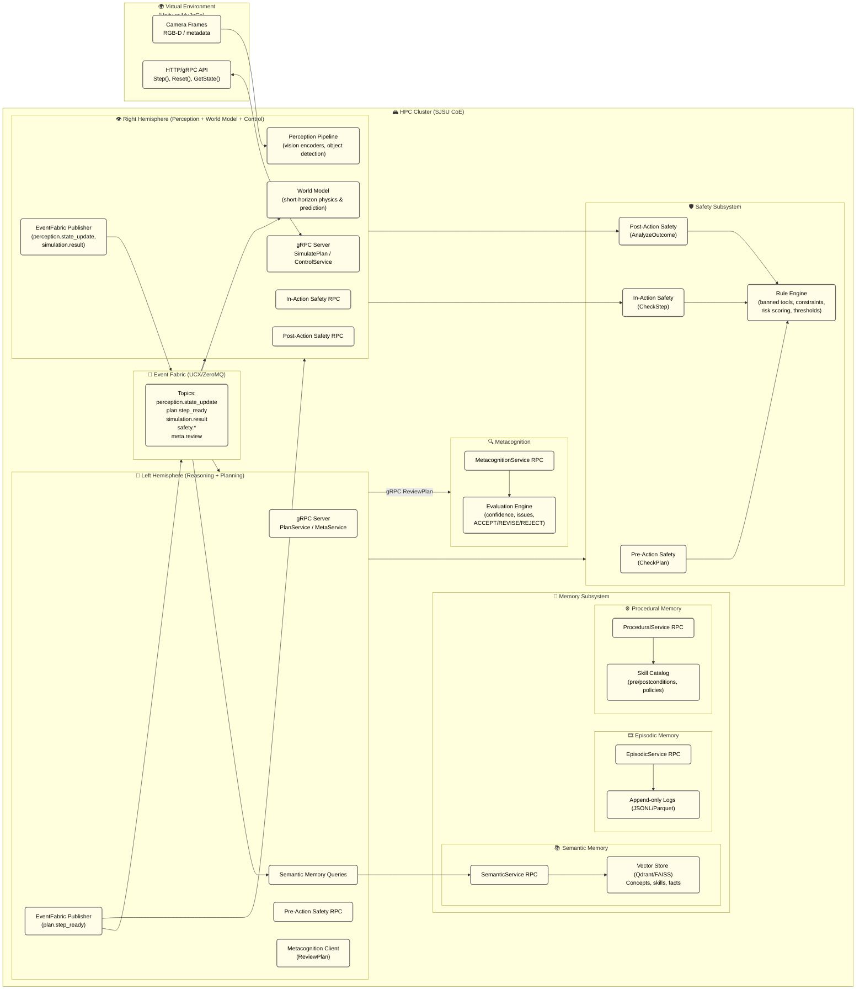

<p align="center">
  <picture>
    <source media="(prefers-color-scheme: dark)" srcset="docs/brand/atlas_mark.svg">
    <source media="(prefers-color-scheme: light)" srcset="docs/brand/atlas_mark_light.svg">
    
  </picture>
</p>

# AGI-HPC
### Atlas AI — embodied, safety-aware AGI architecture for High Performance Computing clusters


> **Brand assets:** [erisml.org/brand/](https://erisml.org/brand/) · local: [`docs/brand/`](docs/brand/)

AGI-HPC is a **modular, distributed, safety-gated cognitive architecture** designed to run on **university-scale HPC clusters** (SJSU CoE HPC) using:

- **Dual-hemisphere cognition** (LH + RH)  
- **Tiered memory subsystem** (semantic, episodic, procedural)  
- **Multi-layer safety system** (pre-action, in-action, post-action)  
- **Virtual embodiment environment** (Unity/MuJoCo)  
- **Event-driven coordination** (UCX/ZeroMQ/NATS JetStream fabric)
- **gRPC services** across all components  
- **Apptainer/Singularity containers** for reproducible HPC deployment

This repository provides the **full scaffolding and automation tools** necessary to build, test, and deploy the system incrementally.

---

# Dev Teams
- Cognitive Architecture (LH/RH) Team
- Memory Systems Team
- EventBus & Messaging Team
- HPC Deployment Team
- Maritime Digital Twin Team
- Unity Simulation Team
- Evaluation & Metrics Team

---

# 📐 Architecture Overview

Below is a high-level diagram of the full AGI-HPC multi-service system:

### Major subsystems

| Subsystem | Responsibilities | Implementation |
|----------|------------------|----------------|
| **Left Hemisphere (LH)** | Planning, reasoning, metacognition pipeline, symbolic tool use | gRPC service + event fabric |
| **Right Hemisphere (RH)** | Perception, world-model simulation, motor control | gRPC service + event fabric |
| **Semantic Memory** | Vector DB for concepts, embeddings, world knowledge | Qdrant/FAISS (placeholder in-memory for now) |
| **Episodic Memory** | Append-only event logs for replay + analysis | JSONL/Parquet logs |
| **Procedural Memory** | Skills, policies, reusable action graphs | In-memory → SQL later |
| **Safety (3-layer)** | Pre-action, in-action, post-action verification | gRPC services + rule engine |
| **Metacognition** | Cross-check plans, confidence estimation, revise/reject loop | gRPC service + trace analyzer |
| **Environment** | Virtual embodiment (Unity/MuJoCo/PyBullet) | Async Gymnasium-compatible interface |
| **Event Fabric** | Topic-based low-latency message bus | Local/ZMQ/Redis/NATS JetStream (pluggable) |

---

# 🧭 Project Layout

```
agi-hpc/
│
├── src/agi/
│   ├── lh/                  # Left Hemisphere (planner, performance, HPC deploy)
│   ├── rh/                  # Right Hemisphere (perception, world model, control)
│   │   └── control/         # Motor primitives, trajectory, realtime, simulation
│   ├── memory/              # Semantic, episodic, procedural, unified memory
│   ├── safety/              # Safety subsystem (pre/in/post + rules + learning)
│   ├── metacognition/       # Reasoning analyzer, consistency, anomaly detection
│   ├── meta/                # LLM-based metacognitive reflection
│   ├── core/                # gRPC, event fabric, DHT, LLM integration
│   │   ├── events/          # Local, ZMQ, Redis, NATS JetStream backends
│   │   ├── dht/             # Hash ring, observability, HPC, security
│   │   └── llm/             # Client, providers, middleware, integration
│   ├── env/                 # Environment interface (MuJoCo, PyBullet, Unity)
│   ├── common/              # Shared utilities (config loader)
│   ├── integration/         # Cross-subsystem integration events
│   └── proto_gen/           # Auto-generated protobuf stubs
│
├── proto/                   
├── configs/                 
├── infra/
│   ├── hpc/                
│   └── local/              
│
├── docs/
├── deploy/                  # Kubernetes / production configs
│
├── scripts/
├── tests/

└── .github/workflows/ci.yaml
```

---

# ⚡ Quickstart: Local Development

### 1. Clone:
```bash
git clone https://github.com/ahb-sjsu/agi-hpc.git
cd agi-hpc
```

### 2. Install dev environment:
```bash
pip install -e ".[dev]"
pre-commit install
```

### 3. Generate protobuf stubs:
```bash
python generate_protos.py --clean
```

### 4. Run LH/RH locally:
```bash
python src/agi/lh/service.py
python src/agi/rh/service.py
```
### Note
```
Local dev (no network)

export AGI_FABRIC_MODE=local


ZMQ (dev multi-process / small cluster)

export AGI_FABRIC_MODE=zmq
export AGI_FABRIC_PUB_ENDPOINT=tcp://fabric:5556
export AGI_FABRIC_SUB_ENDPOINT=tcp://fabric:5555


NATS JetStream (production persistent messaging)

export AGI_FABRIC_MODE=nats
export AGI_FABRIC_NATS_URL=nats://nats-server:4222
export AGI_FABRIC_NATS_STREAM=AGI_HPC_EVENTS
export AGI_FABRIC_CONSUMER_GROUP=agi-hpc


UCX (HPC inter-node)

export AGI_FABRIC_MODE=ucx
export AGI_FABRIC_UCX_ENDPOINT=tcp://fabric-node:13337


Then run a UCX broker/server on fabric-node:13337 that:

accepts UCX connections

reads framed messages with the same [len][topic\0json] format

fans them out to all connected peers.
```
---

# 📜 License
MIT © 2025 Andrew Bond
